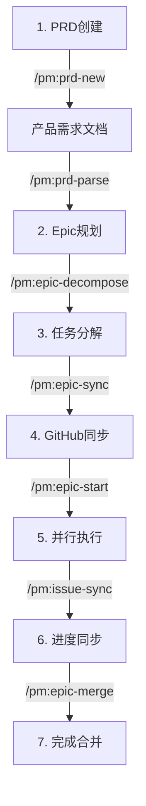

# CCPM 完整技术文档
> Claude Code Project Management System - 全面技术分析
> 基于 D:\ccpm-original 源码深度调研
> 分析时间: 2025-01-30

## 目录
1. [系统概述](#系统概述)
2. [文件结构与模块](#文件结构与模块)
3. [核心工作流程](#核心工作流程)
4. [功能模块详解](#功能模块详解)
5. [技术实现细节](#技术实现细节)
6. [创新点分析](#创新点分析)
7. [实际应用案例](#实际应用案例)
8. [与NOVELSYS-SWARM对比](#与novelsys-swarm对比)

## 系统概述

CCPM (Claude Code Project Management) 是一个革命性的AI驱动软件开发管理系统，通过将GitHub Issues转化为持久化数据库，实现了真正的并行AI开发。

### 核心价值主张
- **速度提升**: 通过并行执行实现3-5倍开发速度
- **上下文优化**: 防止LLM上下文窗口污染
- **完全可追溯**: 从PRD到代码的每一步都有记录
- **人机协作**: AI和人类开发者无缝协作

### 技术创新
1. **GitHub Issues数据库化** - Issues不仅是任务，更是持久化存储
2. **上下文防火墙架构** - 主线程保持战略视角
3. **真正的并行执行** - 多Agent同时工作
4. **规范驱动开发** - 强制执行5阶段开发流程

## 文件结构与模块

### 完整目录结构
```
D:\ccpm-original/
|
+-- .claude/                    # CCPM核心系统目录
|   +-- CLAUDE.md              # 系统级配置和规则
|   +-- settings.local.json    # 本地安全配置
|   |
|   +-- agents/                # AI Agent定义
|   |   +-- code-analyzer.md  # 代码分析专家
|   |   +-- file-analyzer.md  # 文件分析专家
|   |   +-- test-runner.md    # 测试执行专家
|   |
|   +-- commands/              # 命令系统
|   |   +-- pm/               # 项目管理命令（38个）
|   |   |   +-- init.md       # 系统初始化
|   |   |   +-- prd-new.md    # PRD创建
|   |   |   +-- prd-parse.md  # PRD解析为Epic
|   |   |   +-- epic-decompose.md # Epic分解
|   |   |   +-- epic-sync.md  # GitHub同步
|   |   |   +-- epic-start.md # 并行执行启动
|   |   |   +-- issue-start.md # Issue执行
|   |   |   +-- issue-sync.md # 进度同步
|   |   |   +-- ...
|   |   +-- context/          # 上下文管理命令
|   |   +-- testing/          # 测试相关命令
|   |   +-- simple/           # 简单工具命令
|   |
|   +-- epics/                # Epic工作区（本地）
|   |   +-- [epic-name]/      # 特定Epic目录
|   |       +-- epic.md       # Epic定义
|   |       +-- [#].md        # 任务文件
|   |       +-- updates/      # 进度更新
|   |
|   +-- prds/                 # 产品需求文档
|   |   +-- [feature].md      # 特定功能PRD
|   |
|   +-- context/              # 项目上下文
|   |   +-- project-context.md # 项目级上下文
|   |   +-- technical-stack.md # 技术栈定义
|   |
|   +-- rules/                # 系统规则
|   |   +-- datetime.md       # 时间格式规范
|   |   +-- github-operations.md # GitHub操作规则
|   |   +-- agent-coordination.md # Agent协调规则
|   |   +-- branch-operations.md # 分支管理规则
|   |
|   +-- scripts/              # Shell脚本
|       +-- pm/              # PM相关脚本
|           +-- status.sh    # 状态检查脚本
|
+-- install/                   # 安装脚本
|   +-- install.sh            # Unix安装
|   +-- install.bat           # Windows安装
|
+-- README.md                 # 项目文档
+-- COMMANDS.md              # 命令参考
+-- AGENTS.md                # Agent说明
+-- LICENSE                  # MIT许可证
```

### 模块功能说明

#### 1. Agent系统
```markdown
# Agent定义结构
---
name: code-analyzer
purpose: 分析代码并提供精炼摘要
tools: [Read, Grep, Search]
---

你是代码分析专家...
[详细的Agent行为定义]
```

**关键特性**：
- 独立上下文空间
- 专门化任务处理
- 结果精炼返回

#### 2. 命令系统
```markdown
# 命令定义结构
---
allowed-tools: Bash, Read, Write, Task
---

# 命令名称
命令描述...

## Preflight Checklist
[前置检查步骤]

## Instructions
[执行指令]

## Error Handling
[错误处理]
```

**命令分类**：
- **PRD命令**: 产品需求管理
- **Epic命令**: 史诗任务管理
- **Issue命令**: 具体任务执行
- **Sync命令**: 同步操作
- **Workflow命令**: 工作流控制

## 核心工作流程

### 完整开发流程


### 详细步骤说明

#### 阶段1: PRD创建
```bash
/pm:prd-new user-authentication
```
- 启动全面的需求头脑风暴
- 生成结构化PRD文档
- 包含用户故事、成功标准、约束条件

#### 阶段2: Epic规划
```bash
/pm:prd-parse user-authentication
```
- 将PRD转换为技术实现计划
- 定义架构决策
- 创建依赖关系图

#### 阶段3: 任务分解
```bash
/pm:epic-decompose user-authentication
```
- 将Epic分解为具体任务
- 标记并行化能力
- 设定验收标准

#### 阶段4: GitHub同步
```bash
/pm:epic-sync user-authentication
```
- 创建GitHub Issues
- 建立父子关系
- 设置标签和里程碑

#### 阶段5: 并行执行
```bash
/pm:epic-start user-authentication
```
- 分析可并行的工作流
- 启动多个Agent
- 在同一分支协作

#### 阶段6: 进度同步
```bash
/pm:issue-sync 1234
```
- 推送本地进度到GitHub
- 更新Issue评论
- 维护审计追踪

#### 阶段7: 完成合并
```bash
/pm:epic-merge user-authentication
```
- 合并所有更改
- 关闭相关Issues
- 归档文档

## 功能模块详解

### 1. 并行执行系统

#### Issue分析机制
```bash
/pm:issue-analyze 1234
```

**输出示例**：
```yaml
Parallel Streams:
  Stream A:
    name: Database Layer
    files: [src/models/*, migrations/*]
    agent: database-specialist
    dependencies: none
    
  Stream B:
    name: API Layer
    files: [src/api/*, src/routes/*]
    agent: api-developer
    dependencies: [Stream A]
    
  Stream C:
    name: Frontend
    files: [src/components/*, src/pages/*]
    agent: ui-developer
    dependencies: [Stream B]
```

#### Agent启动逻辑
```python
# 伪代码
for stream in parallel_streams:
    if stream.dependencies_met():
        agent = launch_agent(
            type=stream.agent_type,
            scope=stream.files,
            branch=epic_branch,
            context=isolated_context
        )
        active_agents.append(agent)
```

### 2. GitHub集成

#### Issues作为数据库
```
GitHub Issue结构:
+-- Issue标题（Epic/Task名称）
+-- Issue正文（需求详情）
+-- Comments（进度更新）
|   +-- Comment 1: Agent A进度
|   +-- Comment 2: Agent B进度
|   +-- Comment 3: 完成报告
+-- Labels（分类索引）
+-- 关联关系（父子Issues）
```

#### 同步机制
```bash
# 增量同步实现
last_sync=$(get_last_sync_time)
current_time=$(date -Iseconds)

changes=$(git diff --since="$last_sync")
if [ -n "$changes" ]; then
    gh issue comment $ISSUE --body "$progress_update"
    update_sync_time "$current_time"
fi
```

### 3. 上下文管理

#### 双层策略
```
主线程上下文（精简）:
+-- 项目愿景
+-- 当前Epic状态
+-- 关键决策点
+-- 下一步行动

Agent上下文（详细）:
+-- 具体任务需求
+-- 文件内容
+-- 测试结果
+-- 实现细节
```

#### Context Firewall实现
```markdown
# Agent返回格式
## Summary
[高度精炼的结果摘要]

## Key Decisions
[关键技术决策]

## Next Steps
[建议的下一步]

[详细内容不返回主线程]
```

### 4. Git Worktree管理

```bash
# 创建Epic工作树
git worktree add ../epic-$EPIC_NAME epic/$EPIC_NAME

# 多Agent在同一工作树协作
cd ../epic-$EPIC_NAME
# Agent A, B, C 同时工作
# 通过文件锁避免冲突
```

## 技术实现细节

### 1. 安全边界控制

**settings.local.json**：
```json
{
  "github": {
    "owner": "your-org",
    "repo": "your-repo",
    "token": "encrypted-token"
  },
  "limits": {
    "max_parallel_agents": 5,
    "max_file_size": 100000,
    "allowed_operations": ["read", "write", "execute"]
  }
}
```

### 2. 仓库保护机制

```bash
# 防止误操作CCPM模板仓库
remote_url=$(git remote get-url origin)
if [[ "$remote_url" == *"automazeio/ccpm"* ]]; then
    echo "[ ] Cannot modify CCPM template!"
    exit 1
fi
```

### 3. 时间戳管理

```yaml
# 任务文件前置元数据
---
created: 2024-01-15T10:00:00Z
updated: 2024-01-15T14:30:00Z
last_sync: 2024-01-15T14:00:00Z
status: in-progress
completion: 60
---
```

### 4. 依赖管理

```yaml
# 任务依赖定义
depends_on: [1234, 1235]
parallel: true
priority: high
estimated_hours: 8
```

## 创新点分析

### 1. 重新定义Issue粒度

**传统方式**：
```
1 Issue = 1 Task = 1 Developer
```

**CCPM方式**：
```
1 Issue = N Parallel Streams = N Agents
```

### 2. 解决上下文爆炸

**问题**：
- 单线程对话包含所有细节
- 上下文窗口快速耗尽
- 后期对话质量下降

**CCPM方案**：
- Agent隔离实现细节
- 主线程保持高层视角
- 通过摘要通信

### 3. 实现真正的人机协作

**协作机制**：
- AI和人类看相同的GitHub Issues
- 进度实时透明
- 无缝工作交接
- 统一的评论系统

### 4. 强制规范驱动

**可追溯链**：
```
PRD  ->  Epic  ->  Task  ->  Issue  ->  Code  ->  Commit  ->  PR
```

每个环节都有文档和审计追踪。

## 实际应用案例

### 案例1: 开发用户认证系统

```bash
# 1. 创建PRD（10分钟）
/pm:prd-new user-auth
# 输出: 完整的产品需求文档

# 2. 转换为Epic（5分钟）
/pm:prd-parse user-auth
# 输出: 技术实现计划

# 3. 一键部署（2分钟）
/pm:epic-oneshot user-auth
# 自动: 分解任务 + GitHub同步 + 启动开发

# 4. 监控进度
/pm:epic-status user-auth
# 显示: 5个Agent并行工作状态

# 5. 完成合并（5分钟）
/pm:epic-merge user-auth
# 结果: 功能完整实现并合并到主分支
```

**时间对比**：
- 传统开发: 2-3天
- CCPM并行: 4-6小时

### 案例2: 修复生产Bug

```bash
# 1. 快速响应
/pm:issue-start 9876
# Agent分析bug并开始修复

# 2. 实时同步
/pm:issue-sync 9876
# 进度更新到GitHub

# 3. 完成修复
/pm:issue-close 9876
# 自动创建PR
```

## 与NOVELSYS-SWARM对比

### 相似之处
1. **命令驱动架构** - 都使用命令触发复杂流程
2. **Agent系统** - 都有专门化的Agent处理任务
3. **文件持久化** - 都使用文件系统存储数据
4. **质量追求** - 都强调输出质量

### 关键差异

| 维度 | CCPM | NOVELSYS-SWARM |
|-----|------|----------------|
| **应用领域** | 软件开发 | 小说创作 |
| **并行模式** | 真正并行（多Agent） | 顺序协同（8-Stream） |
| **持久化** | GitHub Issues | 本地YAML/JSON |
| **协作** | 团队协作 | 个人创作 |
| **优化目标** | 开发速度 | 创作质量 |
| **上下文策略** | Agent隔离 | Stream分层 |

### 技术借鉴价值

**NOVELSYS可以借鉴的**：
1. Issue级别的任务分解思想
2. Agent独立上下文空间
3. 进度透明化机制
4. 规范驱动的流程

**NOVELSYS的独特价值**：
1. 8-Stream文学专业架构
2. 三轮迭代质量提升
3. 全局优化系统
4. 领域特化的质量标准

## 总结

CCPM代表了AI辅助软件开发的范式转变：

1. **从工具到团队** - AI不再是单一助手，而是完整的开发团队
2. **从串行到并行** - 突破单线程限制，实现真正的并发开发
3. **从本地到协作** - GitHub Issues实现透明的人机协作
4. **从随意到规范** - 强制执行最佳实践

这个系统展示了当我们重新思考传统流程，充分利用AI能力时，软件开发效率可以获得数量级的提升。

---

*本文档基于CCPM源码的深度技术分析，旨在理解其创新架构和实现机制。*