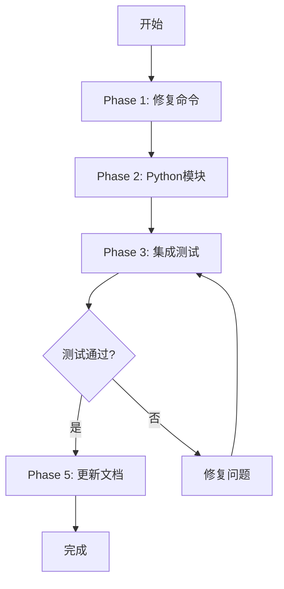

# NOVELSYS-SWARM 完整实施计划

## 🎯 目标：让项目管理系统100%可用

## 📋 详细TODO List

### Phase 1: 核心命令修复 (必须)
- [ ] 1. 修复 `bible-create.md` - 保存到项目目录
- [ ] 2. 修复 `chapter-start.md` - 保存到项目目录  
- [ ] 3. 修复 `quality-check.md` - 从项目目录读取
- [ ] 4. 修复 `context-sync.md` - 使用项目context

### Phase 2: Python支持模块 (必须)
- [ ] 5. 创建 `src/core/project_manager.py`
  - [ ] create_project(name, type)
  - [ ] switch_project(name)
  - [ ] get_current_project()
  - [ ] list_all_projects()
  - [ ] archive_project(name)
  - [ ] get_project_status(name)

- [ ] 6. 更新 `src/commands/command_router.py`
  - [ ] 添加项目管理命令路由
  - [ ] 确保所有命令感知项目上下文

### Phase 3: 集成测试 (必须)
- [ ] 7. 测试完整创作流程
  - [ ] `/novel:init` - 系统初始化
  - [ ] `/novel:project-new "测试小说"` - 创建项目
  - [ ] `/novel:bible-create` - 在项目中创建Bible
  - [ ] `/novel:chapter-start 1` - 生成第一章到项目
  - [ ] 验证文件位置正确

- [ ] 8. 测试项目切换
  - [ ] 创建第二个项目
  - [ ] 切换回第一个项目
  - [ ] 验证上下文正确加载

- [ ] 9. 测试归档功能
  - [ ] `/novel:book-complete` - 完成归档
  - [ ] 验证归档文件完整

### Phase 4: 优化增强 (可选)
- [ ] 10. 添加项目模板功能
- [ ] 11. 添加项目备份/恢复
- [ ] 12. 添加进度可视化
- [ ] 13. 添加批量操作支持

### Phase 5: 文档更新 (必须)
- [ ] 14. 更新README - 真实使用流程
- [ ] 15. 创建QUICKSTART.md - 快速上手指南
- [ ] 16. 更新ARCHITECTURE.md - 项目管理架构

## 🔧 具体修改内容

### 1. 修复 bible-create.md
```yaml
原来: Write("data/bibles/series_bible.yaml", ...)
修改: Write("data/projects/{current_project}/bible.yaml", ...)
```

### 2. 修复 chapter-start.md  
```yaml
原来: Write("data/chapters/ch001/content.md", ...)
修改: Write("data/projects/{current_project}/chapters/ch001/content.md", ...)
```

### 3. 创建 project_manager.py
```python
class ProjectManager:
    def __init__(self):
        self.projects_dir = Path("data/projects")
        self.current_project_file = Path("data/context/current_project.json")
    
    def create_project(self, name: str, project_type: str = "standalone"):
        """创建新项目"""
        # 创建项目目录
        # 初始化project.json
        # 设置为当前项目
    
    def get_current_project(self):
        """获取当前项目"""
        # 读取current_project.json
        # 返回项目名称
```

## 📊 执行顺序



## ⏱️ 时间估算

| Phase | 任务数 | 预计时间 | 优先级 |
|-------|--------|----------|--------|
| Phase 1 | 4 | 30分钟 | 🔴 必须 |
| Phase 2 | 2 | 45分钟 | 🔴 必须 |
| Phase 3 | 3 | 30分钟 | 🔴 必须 |
| Phase 4 | 4 | 60分钟 | 🟡 可选 |
| Phase 5 | 3 | 20分钟 | 🔴 必须 |

**总计：必须任务 2小时，可选任务 1小时**

## 🚀 立即开始

### Step 1: 修复bible-create命令
让Bible保存到当前项目目录而不是全局目录

### Step 2: 修复chapter-start命令
让章节保存到项目的chapters目录

### Step 3: 创建project_manager.py
实现项目管理的核心逻辑

### Step 4: 运行完整测试
创建测试项目，验证全流程

## [x] 完成标准

- [ ] 可以创建多个独立项目
- [ ] 每个项目有独立的Bible和章节
- [ ] 可以随时切换项目继续创作
- [ ] 完成的项目可以归档
- [ ] 所有文件保存在正确位置
- [ ] 项目状态可以查询

## 🎯 开始执行

准备按顺序执行Phase 1-3的必须任务，确保系统真正可用。