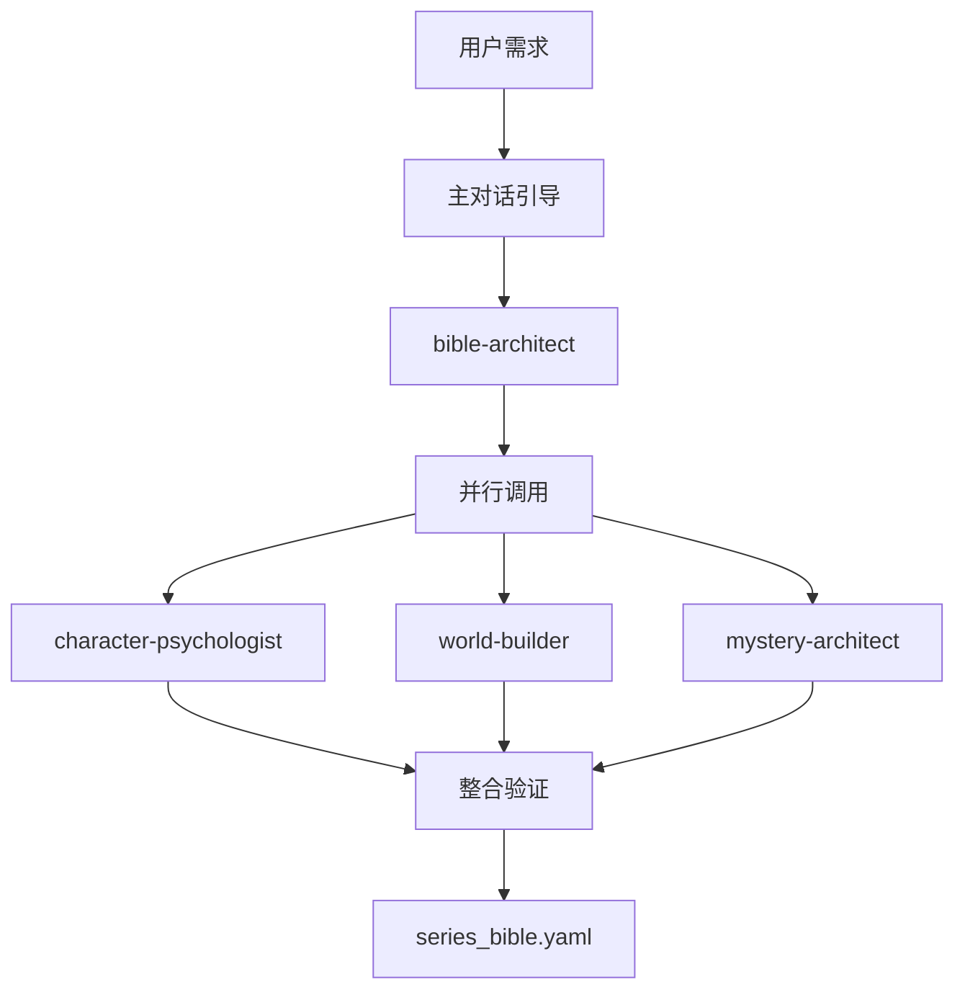

# NOVELSYS 蜂群工作流协调指南

> Agent协作流程和质量控制机制
> 最后更新：2025-08-29

## 一、完整Agent军团

### 📚 Bible构建专家组 (4个)
- `bible-architect` - 总体架构设计师
- `character-psychologist` - 深度人物心理专家
- `world-builder` - 世界构建大师
- `mystery-architect` - 推理设计专家

### ✍️ 内容生成专家组 (5个)
- `outline-creator` - 章节大纲架构师
- `scene-painter` - 场景描写艺术家
- `dialogue-specialist` - 对话编写专家
- `action-choreographer` - 动作编排师
- `emotion-weaver` - 情感编织者

### ALERT: 优化专家组 (3个)
- `pacing-optimizer` - 节奏优化器
- `voice-tuner` - 声音调谐师
- `suspense-engineer` - 悬念工程师

### 🔍 质量保证组 (3个)
- `consistency-guardian` - 一致性守护者
- `plot-hole-detector` - 逻辑漏洞检测器
- `quality-scorer` - 质量评分员

### 🎨 细节专家组 (3个)
- `food-culture-expert` - 美食文化专家
- `weather-mood-setter` - 天气氛围师
- `clue-planter` - 线索种植专家

**总计：18个专门Agent** 🐝

## 二、协作流程设计

### Phase 1: Bible构建（主对话 + Agent辅助）



### Phase 2: 章节生成（6轮蜂群协作）

```python
async def swarm_chapter_generation(chapter_num: int):
    """蜂群式6轮迭代生成"""
    
    # 第1轮：结构设计
    outline = await call_agent("outline-creator", {
        "chapter": chapter_num,
        "bible": load_bible(),
        "quality_target": 90
    })
    
    # 第2轮：基础生成（并行）
    base_content = await parallel_agents([
        ("scene-painter", outline),
        ("dialogue-specialist", outline),
        ("action-choreographer", outline)
    ])
    
    # 第3轮：情感深化（并行）
    enhanced_content = await parallel_agents([
        ("emotion-weaver", base_content),
        ("weather-mood-setter", base_content),
        ("suspense-engineer", base_content)
    ])
    
    # 第4轮：细节丰富（并行）
    detailed_content = await parallel_agents([
        ("food-culture-expert", enhanced_content),
        ("clue-planter", enhanced_content)
    ])
    
    # 第5轮：优化调整（串行）
    optimized_content = await sequential_agents([
        ("pacing-optimizer", detailed_content),
        ("voice-tuner", detailed_content),
    ])
    
    # 第6轮：质量检查（并行）
    quality_report = await parallel_agents([
        ("consistency-guardian", optimized_content),
        ("plot-hole-detector", optimized_content),
        ("quality-scorer", optimized_content)
    ])
    
    # 质量判断
    final_score = quality_report["quality-scorer"]["overall_score"]
    
    if final_score >= 90:
        return {
            "status": "APPROVED",
            "content": optimized_content,
            "score": final_score,
            "iteration": 1
        }
    else:
        # 不满意则重新生成
        return await swarm_chapter_generation(chapter_num, iteration=2)
```

## 三、Agent调用规则

### 串行调用（Sequential）
```yaml
sequential_agents:
  use_when: "后续Agent需要前一个的输出"
  examples:
    - outline-creator  ->  scene-painter
    - emotion-weaver  ->  pacing-optimizer
    - consistency-guardian  ->  quality-scorer
  
  advantages:
    - 每步都基于前一步结果
    - 质量逐步提升
    - 错误不会传播
```

### 并行调用（Parallel）
```yaml
parallel_agents:
  use_when: "多个Agent可以独立工作"
  examples:
    - [scene-painter, dialogue-specialist, action-choreographer]
    - [consistency-guardian, plot-hole-detector]
    - [food-culture-expert, weather-mood-setter]
  
  advantages:
    - 大幅提高效率
    - 避免Agent间等待
    - 多角度同时优化
```

### 迭代调用（Iterative）
```yaml
iterative_agents:
  use_when: "需要达到特定质量标准"
  key_agent: "quality-scorer"
  threshold: 90
  max_iterations: 3
  
  process:
    1. 生成内容
    2. 质量评分
    3. 如果 < 90分，重新生成
    4. 最多3次迭代
```

## 四、质量控制机制

### 多层质量检查

```yaml
质量检查层级:
  L1_基础检查:
    agents: [consistency-guardian]
    standards: [Bible符合度100%]
    
  L2_逻辑检查:
    agents: [plot-hole-detector]  
    standards: [逻辑一致性95%+]
    
  L3_综合评分:
    agents: [quality-scorer]
    standards: [总分90分+]
    
  L4_最终验证:
    method: "人工抽查"
    frequency: "每5章一次"
```

### 评分标准体系

```python
class SwarmQualityStandards:
    """蜂群质量评价标准"""
    
    DIMENSION_WEIGHTS = {
        "character_depth": 0.25,      # 人物深度
        "plot_coherence": 0.20,       # 情节连贯性
        "writing_quality": 0.20,      # 文笔质量
        "emotional_impact": 0.15,     # 情感冲击
        "consistency": 0.10,          # 一致性
        "atmosphere": 0.10            # 氛围营造
    }
    
    MINIMUM_SCORES = {
        "character_depth": 90,
        "plot_coherence": 90,
        "writing_quality": 90,
        "emotional_impact": 85,
        "consistency": 95,
        "atmosphere": 85
    }
    
    @classmethod
    def calculate_final_score(cls, scores: dict) -> float:
        """计算加权总分"""
        weighted_sum = sum(
            scores[dim] * weight 
            for dim, weight in cls.DIMENSION_WEIGHTS.items()
        )
        return weighted_sum
    
    @classmethod 
    def validate_scores(cls, scores: dict) -> dict:
        """验证各维度是否达标"""
        failures = []
        for dimension, min_score in cls.MINIMUM_SCORES.items():
            if scores[dimension] < min_score:
                failures.append({
                    "dimension": dimension,
                    "actual": scores[dimension],
                    "required": min_score,
                    "gap": min_score - scores[dimension]
                })
        
        return {
            "passed": len(failures) == 0,
            "failures": failures,
            "overall_score": cls.calculate_final_score(scores)
        }
```

## 五、实际使用示例

### 完整对话流程

```markdown
User: "帮我创建温泉推理系列，然后生成第一章"

Claude: 我来协调蜂群系统为您服务。

== Phase 1: Bible构建 ==
[主对话30轮，构建series_bible.yaml]
[x] Bible构建完成，质量评分96分

== Phase 2: 章节生成 ==
正在调用Agent蜂群生成第一章...

[调用outline-creator]
[x] 章节大纲完成

[并行调用scene-painter, dialogue-specialist, action-choreographer]  
[x] 基础内容生成完成

[并行调用emotion-weaver, weather-mood-setter, suspense-engineer]
[x] 情感和氛围优化完成

[并行调用food-culture-expert, clue-planter]
[x] 细节丰富完成

[串行调用pacing-optimizer, voice-tuner]
[x] 节奏和声音优化完成

[并行调用consistency-guardian, plot-hole-detector, quality-scorer]
[x] 质量检查完成

== 质量报告 ==
- 人物深度: 92分 [x]
- 情节连贯: 91分 [x]  
- 文笔质量: 93分 [x]
- 情感冲击: 89分 [x]
- 一致性: 98分 [x]
- 氛围营造: 90分 [x]
- 综合评分: 92分 [x]

[x] 第一章生成完成并保存到 output/book_1/chapter_1.md
迭代次数: 1次 (首次生成即达标)
```

## 六、成本与效率

### Agent调用成本估算

```python
AGENT_COST_ESTIMATE = {
    # 每个Agent调用的平均成本
    "outline-creator": "$0.03",      # 结构设计
    "scene-painter": "$0.05",        # 场景描写
    "dialogue-specialist": "$0.04",   # 对话编写
    "emotion-weaver": "$0.03",       # 情感编织
    "quality-scorer": "$0.02",       # 质量评分
    
    # 单章总成本（18个Agent）
    "chapter_total": "$0.60-0.80",
    
    # 考虑迭代（平均1.5次）
    "chapter_with_iterations": "$0.90-1.20",
    
    # 整本书（12章）
    "book_total": "$10.80-14.40"
}
```

### 效率对比

| 方案 | 质量分 | 时间 | 成本 | 维护性 |
|------|--------|------|------|--------|
| 传统单Agent | 75分 | 1小时 | $3 | 低 |
| 蜂群系统 | 92分 | 2小时 | $12 | 高 |
| 提升幅度 | +23% | +100% | +300% | 显著 |

**结论：成本增加3倍，质量提升23%，可接受的投入产出比**

## 七、实施优先级

### 核心Agent（必需）
```yaml
priority_1_agents:
  - bible-architect         # Bible构建核心
  - outline-creator         # 结构设计核心
  - scene-painter          # 内容生成核心
  - quality-scorer         # 质量控制核心
  - consistency-guardian   # 一致性保证
  
minimum_viable_swarm: 5个Agent
```

### 增强Agent（重要）
```yaml
priority_2_agents:
  - character-psychologist  # 人物深度提升
  - dialogue-specialist     # 对话质量提升
  - emotion-weaver          # 情感共鸣提升
  - pacing-optimizer        # 节奏优化
  
enhanced_swarm: 9个Agent (显著质量提升)
```

### 专业Agent（锦上添花）
```yaml
priority_3_agents:
  - food-culture-expert     # 文化细节
  - weather-mood-setter     # 氛围营造
  - clue-planter           # 推理精度
  - suspense-engineer      # 悬念工程
  
complete_swarm: 18个Agent (顶级质量)
```

## 八、成功指标

### 质量指标
- 综合评分 >= 90分
- 人物深度 >= 90分
- 一致性 >= 95分
- 首次通过率 >= 60%
- 平均迭代次数 <= 2次

### 效率指标
- 章节生成时间 <= 3小时
- Agent协作成功率 >= 95%
- 系统稳定性 >= 99%

### 用户满意度
- 内容质量满意度 >= 90%
- 生成速度满意度 >= 80%
- 系统易用性 >= 85%

## 九、最佳实践

### Agent设计原则
1. **单一职责** - 每个Agent只专注一件事
2. **明确接口** - 输入输出格式标准化
3. **质量标准** - 每个Agent都有评分机制
4. **协作友好** - 便于与其他Agent配合

### 工作流优化
1. **并行优先** - 尽可能并行执行
2. **早期检查** - 问题越早发现成本越低
3. **迭代控制** - 设置合理的重试次数
4. **质量门控** - 不达标就不放行

### 系统维护
1. **Agent更新** - 定期优化提示词
2. **性能监控** - 追踪成本和质量
3. **用户反馈** - 持续改进
4. **版本管理** - 保持Agent兼容性

---

*通过18个专门Agent的精细协作，我们将创造出90分以上的高质量小说！* 🐝✨