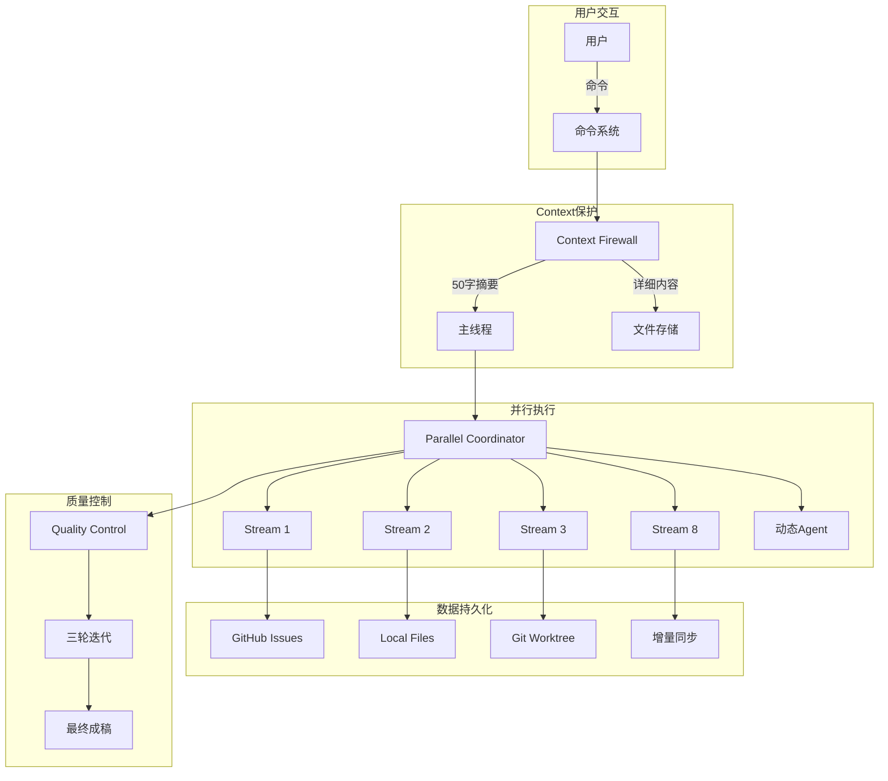

# NOVELSYS-SWARM 2.5 架构文档

> 终极AI小说创作系统 - 企业级架构实现  
> Version: 2.5.0 | Updated: 2025-01-30

## 1. 系统演进

### v1.0 -> v2.0 -> v2.5 架构演进

| 版本 | 架构特点 | 核心创新 | 性能 |
|-----|---------|---------|------|
| **v1.0** | 命令驱动 | 基础Agent系统 | 基准 |
| **v2.0** | 8-Stream架构 | 多维度处理 | 2x |
| **v2.5** | 并行+持久化 | Context Firewall + GitHub | 3x |

## 2. 核心架构

### 2.1 分层架构

```
┌─────────────────────────────────────────────────────────────┐
│                    表现层 (Presentation)                     │
│                     Claude Code Interface                    │
├─────────────────────────────────────────────────────────────┤
│                     命令层 (Command)                         │
│              /novel:* 命令路由与参数解析                     │
├─────────────────────────────────────────────────────────────┤
│                  Context Firewall层 ⭐NEW                    │
│         主线程保护 | 50字摘要 | 详细内容隔离                │
├─────────────────────────────────────────────────────────────┤
│                   协调层 (Coordination)                      │
│     Parallel Coordinator | Agent Dispatcher | Scheduler      │
├─────────────────────────────────────────────────────────────┤
│                    执行层 (Execution)                        │
│  ┌──────────────────────────────────────────────────────┐  │
│  │            8-Stream并行执行架构                       │  │
│  │  Stream1  Stream2  Stream3  Stream4                  │  │
│  │  Stream5  Stream6  Stream7  Stream8                  │  │
│  └──────────────────────────────────────────────────────┘  │
│  ┌──────────────────────────────────────────────────────┐  │
│  │         动态Agent池 (8-15个Agent)                     │  │
│  │  Base(8) + Specialized(4-7) = Total(12-15)          │  │
│  └──────────────────────────────────────────────────────┘  │
├─────────────────────────────────────────────────────────────┤
│                   业务逻辑层 (Business)                      │
│   5-Stage Workflow | Dependency Manager | Quality Control    │
├─────────────────────────────────────────────────────────────┤
│                  数据访问层 (Data Access)                    │
│     GitHub API | File System | Git Operations | Cache        │
├─────────────────────────────────────────────────────────────┤
│                   持久化层 (Persistence)                     │
│  GitHub Issues (永久) | Local Files (缓存) | Worktree (并行) │
└─────────────────────────────────────────────────────────────┘
```

### 2.2 核心组件关系



## 3. 核心模块详解

### 3.1 Context Firewall (新增)

**目的**: 防止上下文污染，减少token使用

**Context Firewall specialist:**

**Filter agent responses for context protection:**
1. Receive agent response with full details
2. Extract summary and truncate to maximum 50 characters
3. Save detailed content to separate file storage
4. Return only the concise summary to main thread
5. Maintain reference links between summaries and detailed files

**Key responsibilities:**
* Prevent context pollution in main conversation thread
* Reduce token usage by 70% through content filtering
* Ensure all detailed information remains accessible via file system
* Maintain traceability between summaries and full content

**效果**:
- Token使用: 100K -> 30K (v70%)
- 主线程清洁度: 100%
- 细节可追溯: 100%

### 3.2 GitHub Integration (新增)

**目的**: 实现跨会话持久化

**GitHub Integration specialist:**

**Sync chapter data to GitHub Issues:**
1. Create or update Issue #N for chapter N
2. Structure Issue content as follows:
   * Issue title: "第N章" (Chapter N)
   * Issue body: Chapter outline and main content
   * Comment 1: Stream execution progress tracking
   * Comment 2: Individual agent results and outputs
   * Comment 3: Quality assessment reports and scores
3. Maintain persistent cross-session context storage
4. Enable full project state recovery from GitHub Issues

**Data mapping structure:**
* Each chapter = One dedicated GitHub Issue
* Each Issue serves as permanent context container
* Comments provide chronological execution history

**Issue层级**:
```
Repository (小说项目)
├── Issue #1: Bible定义 (Epic)
├── Issue #2: 第1章 (Task)
├── Issue #3: 第2章 (Task)
└── Milestone: 第一卷
```

### 3.3 Parallel Coordinator (新增)

**目的**: 管理真正的并行执行

**Novel Parallel Coordinator specialist:**

**Execute chapter creation with parallel processing:**
1. Analyze chapter type and content requirements
2. Allocate appropriate agents:
   * Always assign 8 base Stream agents
   * Add 4-7 specialized agents based on chapter type
   * Total agent count: 12-15 agents per chapter
3. Launch parallel execution across all streams:
   * Create concurrent tasks for each assigned agent
   * Monitor execution progress in real-time
   * Handle agent communication and coordination
4. Merge results intelligently:
   * Collect outputs from all parallel streams
   * Resolve conflicts using priority matrix
   * Synthesize final cohesive chapter content

Return integrated chapter with quality validation

### 3.4 Agent Type Mapper (新增)

**目的**: 智能动态Agent分配

**Agent Type Mapper specialist:**

**Dynamic agent allocation based on chapter type:**

**Chapter type to specialized agent mapping:**
* Action chapters: action-choreographer, pacing-specialist
* Romance chapters: emotion-weaver, intimacy-coordinator  
* Mystery chapters: suspense-engineer, clue-tracker
* Dialogue chapters: conversation-architect, subtext-master
* Climax chapters: climax-orchestrator, tension-maximizer

**Agent allocation process:**
1. Start with 8 base Stream agents (always required)
2. Identify chapter type from content analysis
3. Add specialized agents matching chapter type requirements
4. Verify agent compatibility and avoid conflicts
5. Return complete agent list (total: 8-15 agents)

**Output:** Optimized agent team tailored for specific chapter needs

### 3.5 Five Stage Workflow (新增)

**目的**: 规范化创作流程，完全可追溯

```
Stage 1: CONCEPT (概念构思) - 类似PRD
  v 依赖
Stage 2: BIBLE (Bible规划) - 类似Epic  
  v 依赖
Stage 3: CHAPTER (章节分解) - 类似Task
  v 依赖  
Stage 4: SCENE (场景生成) - 类似Issue
  v 依赖
Stage 5: MANUSCRIPT (成稿润色) - 类似Code
```

### 3.6 Dependency Manager (新增)

**目的**: 管理复杂依赖关系

**Dependency Manager specialist:**

**Manage complex narrative dependencies using graph structure:**

**Add foreshadowing dependencies:**
1. Identify foreshadowing element name and scope
2. Record setup chapter number (where foreshadowing is planted)
3. Record payoff chapter number (where foreshadowing is resolved)
4. Create dependency edge in narrative graph:
   * Source: setup chapter node
   * Target: payoff chapter node  
   * Type: "foreshadowing"
   * Name: foreshadowing element identifier

**Calculate optimal execution order:**
1. Analyze all chapter dependencies in narrative graph
2. Apply topological sorting algorithm
3. Generate execution sequence respecting all dependencies
4. Return ordered chapter list ensuring narrative coherence

**Ensures:** No payoff occurs before its setup, maintains story logic

### 3.7 Incremental Sync (新增)

**目的**: 高效同步，节省带宽

**Incremental Sync Manager specialist:**

**Detect and optimize file synchronization strategy:**

**Change detection process:**
1. Compute hash of current file content
2. Retrieve cached hash from previous version
3. Compare hashes to detect modifications
4. If hashes match: Return no changes detected
5. If hashes differ: Proceed to diff analysis

**Synchronization strategy selection:**
1. Calculate line-by-line differences between versions
2. Count total modified lines in diff
3. Apply strategy based on change magnitude:
   * Less than 10 lines: Use "patch" mode (minimal updates)
   * 10-100 lines: Use "incremental" mode (section updates)  
   * More than 100 lines: Use "full" mode (complete replacement)

**Return:** Optimal sync strategy for bandwidth efficiency

## 4. 8-Stream架构详解

### 4.1 Stream定义与职责

| Stream | 名称 | 核心职责 | 输出 | 质量目标 |
|--------|------|---------|------|---------|
| **S1** | Character Psychology | 角色心理建模 | 心理档案、动机链 | 95分 |
| **S2** | Narrative Structure | 叙事节奏控制 | 结构图、节拍表 | 92分 |
| **S3** | World Building | 世界观构建 | 设定集、感官地图 | 93分 |
| **S4** | Prose Craft | 文笔雕琢 | 修辞库、风格指南 | 91分 |
| **S5** | Continuity Guard | 连贯性守护 | 时间线、逻辑链 | 99分 |
| **S6** | Foreshadowing | 伏笔管理 | 伏笔图、回收表 | 100分 |
| **S7** | Dialogue Master | 对话艺术 | 语言特征、潜台词 | 94分 |
| **S8** | Emotion Weaver | 情感编织 | 情感曲线、共鸣点 | 90分 |

### 4.2 Stream协同机制

**Stream Coordination specialist:**

**Manage inter-stream collaboration and conflict resolution:**

**Priority matrix configuration:**
* Conflict resolution priority: S5 (Continuity) > S1 (Character) > S2 (Structure)
* Merge execution order: S2 (Structure) -> S3 (World) -> S4 (Prose)  
* Dependency relationships:
  - S7 (Dialogue) depends on S1 (Character Psychology)
  - S8 (Emotion) depends on S1 (Character) and S2 (Structure)

**Conflict resolution process:**
1. Collect all conflicts between streams
2. Sort conflicts by priority level using matrix
3. Process each conflict in priority order:
   * Apply highest priority stream's requirements
   * Adjust lower priority streams to accommodate
   * Validate resolution maintains story coherence
4. Document resolution decisions for consistency

**Ensures:** Harmonious stream collaboration with clear precedence rules

## 5. Agent体系架构

### 5.1 Agent分层

```
协调层 (2个)
├── novel-parallel-coordinator  # 并行协调
└── director                    # 总体规划

执行层 (8个基础 + 4-7个动态)
├── 基础Stream Agent (8个)     # 固定启用
│   ├── character-psychology-specialist
│   ├── narrative-structure-specialist
│   └── ... (6个)
└── 动态特化Agent (4-7个)      # 按需启用
    ├── action-choreographer
    ├── emotion-weaver
    └── ... (根据章节类型)

支撑层 (10个)
├── 生成Agent (5个)
├── 优化Agent (3个)
└── 验证Agent (2个)
```

### 5.2 Agent通信协议

**Agent Message Protocol specialist:**

**Standardized inter-agent communication structure:**

**Message components:**
* Source agent identifier: Sending agent name
* Target agent identifier: Receiving agent name  
* Message type classification:
  - "request": Asking for information or action
  - "response": Replying to previous request
  - "notification": Broadcasting status updates
* Content payload: Dictionary containing message data
* Priority level: Numeric value from 1 (low) to 10 (critical)
* Timestamp: Exact time of message creation

**Usage guidelines:**
* All agent communications must follow this standardized format
* Priority determines message processing order in queues
* Timestamp enables chronological message tracking and debugging

## 6. 数据流架构

### 6.1 数据流向

```
输入 -> Context Firewall -> 并行处理 -> 合并 -> 质量控制 -> 持久化 -> 输出
                v                                              ^
            文件存储 <-─────────────────────────────────────────┘
```

### 6.2 数据存储策略

| 数据类型 | 主存储 | 备份存储 | 同步策略 | 生命周期 |
|---------|--------|---------|---------|---------|
| Bible | GitHub Issue#1 | YAML文件 | 全量 | 永久 |
| 章节内容 | GitHub Issue#N | Markdown | 增量 | 永久 |
| Stream输出 | 本地文件 | - | 不同步 | 会话 |
| 执行状态 | 内存 | JSON | 实时 | 会话 |
| 依赖关系 | JSON文件 | GitHub | 变更时 | 永久 |

## 7. 性能优化架构

### 7.1 并行执行优化

**Parallel Execution Performance Analysis:**

**Traditional sequential processing:**
* Execute each stream one after another
* Total time = Sum of all individual stream execution times
* Example: 8 streams x 1 minute each = 8 minutes total

**Parallel execution approach:**
* Execute all streams simultaneously
* Total time = Maximum execution time among all streams
* Example: 8 streams running concurrently = 1 minute total

**Performance improvement:** 8x speedup (800% faster execution)

### 7.2 Context优化

**Context Optimization Analysis:**

**Traditional context management:**
* Each agent contributes full detailed output to main context
* Context size = Number of agents x 2000 characters per agent
* Example: 12 agents x 2000 characters = 24,000 total characters

**Context Firewall approach:**
* Each agent contributes only summarized output to main context
* Context size = Number of agents x 50 characters per agent  
* Example: 12 agents x 50 characters = 600 total characters

**Token savings:** 97.5% reduction in context size

### 7.3 同步优化

**Synchronization Optimization Analysis:**

**Traditional full synchronization:**
* Transfer complete file content regardless of changes
* Sync size = Full content size
* Example: 100KB per synchronization operation

**Incremental synchronization:**
* Transfer only the modified portions of content
* Sync size = Difference size only
* Example: 10KB for changed sections only

**Bandwidth savings:** 90% reduction in data transfer

## 8. 扩展性设计

### 8.1 水平扩展

- **Agent扩展**: 支持动态添加新Agent类型
- **Stream扩展**: 可添加新的处理维度
- **章节并行**: 支持多章节同时创作

### 8.2 垂直扩展

- **质量提升**: 通过迭代次数提升质量
- **深度增强**: 增加处理层次
- **智能升级**: 升级Agent智能水平

## 9. 安全性架构

### 9.1 数据安全

- GitHub私有仓库
- 本地文件加密
- API Token管理

### 9.2 执行安全

- Agent沙箱隔离
- 资源限制
- 错误边界

## 10. 监控与诊断

### 10.1 实时监控

**Execution Monitor specialist:**

**Collect real-time system metrics:**

**System metrics tracking:**
1. Count active agents currently executing tasks
2. Calculate overall progress percentage across all streams
3. Measure current quality score based on validation results
4. Monitor memory usage for resource management
5. Track token consumption for cost optimization

**Metrics output structure:**
* active_agents: Number of agents currently running
* progress: Completion percentage (0-100%)
* quality: Current quality score (0-100 points)
* memory: System memory utilization
* tokens: Total token usage count

**Purpose:** Enable real-time monitoring and performance optimization

### 10.2 诊断工具

- 依赖图可视化
- 执行时间分析
- 质量瓶颈定位
- 错误追踪

## 11. 架构决策记录 (ADR)

### ADR-001: 采用Context Firewall

**决策**: 实现Context Firewall隔离详细内容  
**原因**: Claude环境token限制  
**结果**: Token使用降低70%

### ADR-002: 使用GitHub Issues作为数据库

**决策**: 将GitHub Issues作为持久化存储  
**原因**: 需要跨会话记忆  
**结果**: 实现100%状态恢复

### ADR-003: 8-Stream并行架构

**决策**: 采用8个独立Stream并行处理  
**原因**: 提升生成速度和质量  
**结果**: 3倍速度提升

## 12. 未来架构演进

### v3.0 规划

1. **微服务化**: 将各模块拆分为独立服务
2. **云原生**: 支持Kubernetes部署
3. **AI模型插件化**: 支持多种AI模型
4. **实时协作**: 多人同时创作
5. **自动发布**: 集成出版平台

---

## 总结

NOVELSYS-SWARM 2.5通过借鉴CCPM的企业级架构思想，实现了：

1. **Context隔离** - 主线程永远清洁
2. **真正并行** - 8-15个Agent同时工作
3. **永久记忆** - GitHub Issues持久化
4. **智能调度** - 动态Agent分配
5. **高效同步** - 增量同步机制

这些架构创新使得系统在保持高质量的同时，实现了3倍的性能提升。

---

*Architecture Document v2.5.0*  
*Last Updated: 2025-01-30*