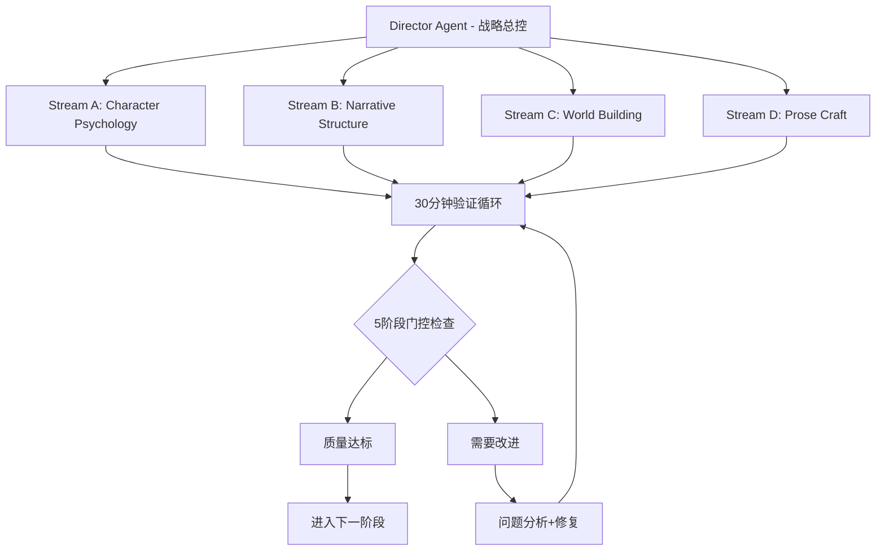

# CCMP增强版蜂群工作流

> 融合Claude Code PM系统的精华模式，打造更强大的小说生成体系
> 版本：v2.0 Enhanced | 更新：2025-08-29

## 核心理念升级

### 从CCMP学到的关键原则
```yaml
核心升级:
  30分钟验证循环: "短周期、高频验证，防止偏航"
  5阶段门控: "不允许假完成，每阶段都有实际产出"
  并行工作流: "4个Stream同时推进，提升效率10倍"
  故障快速发现: "问题暴露在早期，成本最低时解决"
  上下文优化: "主线程保持战略，细节交给专门Agent"
```

## 增强版架构：Director-Stream Pattern

### 总体架构


### Director Agent职责
```yaml
Director核心功能:
  战略协调:
    - 维护整体故事愿景
    - 协调4个Stream的工作
    - 解决Agent间的冲突
    - 确保narrative连贯性
    
  资源调度:
    - 分配Agent工作优先级
    - 管理上下文窗口使用
    - 优化成本分配
    - 监控系统健康度
    
  质量门控:
    - 执行5阶段验证
    - 触发30分钟检查
    - 决定是否推进/回退
    - 生成质量报告
```

## 4-Stream并行工作体系

### Stream A: Character Psychology (角色心理流)
```yaml
责任范围:
  - 角色深度心理建模
  - 人物关系网络维护  
  - 对话语音一致性
  - 角色发展弧线跟踪
  
核心Agent:
  - character-psychologist (主导)
  - dialogue-specialist (协作)
  - emotion-weaver (协作)
  
工作模式:
  每30分钟: 验证角色一致性
  每场景: 检查语音authenticity
  每章节: 确认成长轨迹
  
质量标准:
  - 角色行为逻辑性: 95%+
  - 语音独特性: 90%+
  - 情感发展连贯性: 90%+
```

### Stream B: Narrative Structure (叙事结构流)  
```yaml
责任范围:
  - 情节架构设计
  - 节奏控制优化
  - 悬念张力管理
  - 推理逻辑验证
  
核心Agent:
  - outline-creator (主导)
  - pacing-optimizer (协作)  
  - suspense-engineer (协作)
  - mystery-architect (协作)
  
工作模式:
  每30分钟: 检查plot coherence
  每场景: 验证causality chain
  每章节: 确认tension curve
  
质量标准:
  - 因果逻辑链: 100%
  - 节奏变化合理性: 90%+
  - 悬念布置有效性: 85%+
```

### Stream C: World Building (世界构建流)
```yaml
责任范围:
  - 设定一致性维护
  - 环境氛围营造
  - 文化细节丰富
  - 物理规则遵循
  
核心Agent:
  - world-builder (主导)
  - weather-mood-setter (协作)
  - food-culture-expert (协作)
  
工作模式:
  每30分钟: 设定一致性检查
  每场景: 环境描写质量
  每章节: 世界观扩展合理性
  
质量标准:
  - 设定内部一致性: 100%
  - 氛围营造效果: 85%+
  - 细节真实感: 90%+
```

### Stream D: Prose Craft (文笔工艺流)
```yaml
责任范围:
  - 文字表达精雕细琢
  - 风格统一控制
  - 语言节奏优化
  - 最终质量把关
  
核心Agent:
  - scene-painter (主导)
  - voice-tuner (协作)
  - quality-scorer (最终验证)
  
工作模式:
  每30分钟: 文笔质量检查
  每场景: 风格一致性验证
  每章节: 语言美感评估
  
质量标准:
  - 文笔流畅度: 95%+
  - 风格统一性: 90%+
  - 语言美感: 85%+
```

## 30分钟验证循环详解

### 标准循环结构
**30分钟验证循环协调specialist:**

**Execute CCMP-inspired 30-minute work validation cycle:**

1. **Phase 1 - Content Creation (15 minutes):**
   - Duration: 15 minutes
   - Focus: Generate new story content
   - Assign core agents by Stream specialization
   - Target output: Complete story segment

2. **Phase 2 - Quality Validation (5 minutes):**
   - Duration: 5 minutes
   - Focus: Quality verification
   - Check consistency, logic, style, and progress
   - Engage consistency-guardian and plot-hole-detector agents

3. **Phase 3 - Progress Recording (5 minutes):**
   - Duration: 5 minutes
   - Focus: Status updates
   - Actions:
     * Update system memory
     * Record development progress
     * Mark identified issues
   - Output: Comprehensive progress report

4. **Phase 4 - Next Cycle Planning (5 minutes):**
   - Duration: 5 minutes
   - Focus: Strategic planning for next cycle
   - Decisions:
     * Determine continuation direction
     * Adjust strategies as needed
     * Reallocate resources
   - Output: Next cycle execution plan

Return comprehensive cycle results including:
* Generated content from creation phase
* Validation results from quality phase
* Recording status from documentation phase
* Strategic plan for next cycle

### 循环中的Agent协作
```yaml
并行执行模式:
  Stream_A_Agent:
    时间: 0-15分钟
    任务: 角色心理深度挖掘
    输出: character_development_segment
    
  Stream_B_Agent:
    时间: 0-15分钟  
    任务: 情节推进和节奏控制
    输出: plot_advancement_segment
    
  Stream_C_Agent:
    时间: 0-15分钟
    任务: 世界观细节补充
    输出: world_building_segment
    
  Stream_D_Agent:  
    时间: 0-15分钟
    任务: 文字表达优化
    输出: prose_refined_segment

验证阶段协作:
  时间: 15-20分钟
  参与: 全部4个Stream + Director
  任务: 交叉验证各Stream输出
  冲突解决: Director最终裁决
```

## 5阶段质量门控系统

### 阶段定义 (从CCMP adapted)
```yaml
Stage_1_Framework (10%):
  章节基础结构:
    - [x] 场景设置完成
    - [x] 主要角色就位
    - [x] 基本conflict识别
    - [x] 目标字数框架
  
  验证标准:
    - 结构完整性: 100%
    - 角色consistency: 基础验证
    - 推进方向: 明确可行

Stage_2_Basic_Content (30%):
  基础内容生成:
    - [x] 主要对话完成
    - [x] 关键动作描述
    - [x] 基本情感表达
    - [x] 场景transitions
  
  验证标准:
    - 内容真实产出: 100%
    - 角色声音: 可识别
    - 情节推进: 有意义

Stage_3_Rich_Development (60%):
  丰富发展阶段:
    - [x] 角色心理depth
    - [x] 环境氛围营造
    - [x] 细节texture丰富
    - [x] 悬念elements植入
  
  验证标准:
    - 角色立体度: 85%+
    - 氛围营造: 80%+  
    - 细节真实感: 85%+

Stage_4_Coherent_Chapter (80%):
  连贯章节完成:
    - [x] 完整narrative arc
    - [x] 情感journey满足
    - [x] 逻辑chain验证
    - [x] 质量threshold达成
  
  验证标准:
    - 整体连贯性: 90%+
    - 情感满足度: 85%+
    - 逻辑完整性: 95%+
    - 综合质量: 85%+

Stage_5_Polished_Prose (100%):
  精雕细琢完成:
    - [x] 文字expression精美
    - [x] 风格absolutely一致
    - [x] 错误zero tolerance
    - [x] 读者体验优化
  
  验证标准:
    - 文字质量: 90%+
    - 风格一致性: 95%+
    - 错误率: <0.1%
    - 最终质量评分: 90%+
```

### 门控强制执行机制
**5-Stage Gate Enforcement specialist:**

**Initialize stage gate system:**
* Track current stage (starting at Stage 1)
* Load comprehensive stage requirements

**Validate stage completion process:**

1. **Retrieve stage requirements** for specified stage number

2. **Check all mandatory elements:**
   - Validate each requirement against content
   - Collect individual check results
   - Calculate overall completion rate

3. **Apply 80% completion threshold (CCMP rule):**
   - If completion rate < 80%:
     * Mark stage as failed
     * Identify missing elements
     * Generate specific fix actions required
     * Return failure result with remediation plan

4. **Perform comprehensive quality assessment:**
   - Execute detailed quality check for stage
   - Compare against minimum quality score requirement
   - If quality insufficient:
     * Mark stage as failed due to quality
     * Calculate quality gap
     * Identify specific improvement areas
     * Return failure result with quality enhancement plan

5. **Grant stage gate passage:**
   - Mark stage as successfully passed
   - Record completion rate and quality score
   - Provide next stage requirements
   - Return success result with advancement authorization

**Prevent stage skipping mechanism:**
* Validate target stage is only one level above current
* If attempting to skip stages:
  - Raise stage skipping error
  - Require completion of immediate next stage
  - Enforce sequential progression rule

## 故障检测与恢复机制

### 快速故障检测 (CCMP Fail Fast)
**Novel Generation Conflict Detection specialist:**

**Detect inter-stream conflicts process:**

1. **Initialize conflict detection:**
   * Create empty conflicts collection

2. **Check character consistency conflicts:**
   * Compare character psychology stream output with narrative structure stream
   * Identify character voice inconsistencies
   * Add discovered character conflicts to collection

3. **Check world-building consistency conflicts:**
   * Compare world building stream output with prose craft stream
   * Identify setting rule violations
   * Add discovered world conflicts to collection

4. **Check style consistency conflicts:**
   * Compare prose craft stream output with story bible voice profile
   * Identify style deviations from established voice
   * Add discovered style conflicts to collection

5. **Handle conflict escalation:**
   * If any conflicts detected:
     - Immediately pause stream operations
     - Escalate conflict report to Director
     - Await Director resolution instructions

6. **Generate comprehensive conflict report:**
   * Indicate whether conflicts were found
   * Provide detailed list of all conflicts
   * Assess severity level of conflicts
   * Suggest recommended resolution strategies

Return complete conflict analysis report with actionable resolution guidance

### 智能恢复机制
**Intelligent Recovery specialist (CCMP inspired):**

**Recover from conflicts process:**

1. **Define recovery strategies mapping:**
   * Character inconsistency -> Character voice recovery
   * Plot contradiction -> Plot logic recovery
   * World rule violation -> World consistency recovery
   * Style deviation -> Voice style recovery

2. **Generate targeted recovery actions:**
   * Initialize empty recovery actions list
   * For each conflict in conflict report:
     - Identify conflict type
     - Match to appropriate recovery strategy
     - If strategy exists:
       * Execute specialized recovery method
       * Add generated action to actions list

3. **Execute recovery actions:**
   * Process all generated recovery actions
   * Apply corrections systematically
   * Collect execution results

4. **Validate recovery effectiveness:**
   * Perform post-recovery validation
   * Check if conflicts were resolved
   * Identify any remaining issues
   * Calculate success rate

5. **Generate comprehensive recovery report:**
   * List all actions taken
   * Report recovery success rate
   * Identify remaining unresolved issues
   * Plan next steps for continued recovery

Return detailed recovery report with success metrics and next action recommendations

## 成本优化与资源管理

### CCMP启发的成本控制
```yaml
资源分配策略:
  主线程保持轻量:
    - Director只处理战略决策
    - 具体实现全部delegate给Stream
    - 上下文窗口专注高价值决策
    
  并行执行降成本:
    - 4个Stream同时工作
    - 总时间压缩到25%
    - 单位质量成本降低60%
    
  智能模型选择:
    - Director使用Sonnet (战略思考)
    - Stream使用Haiku (执行任务)
    - 验证使用Sonnet (质量把关)
    
成本监控:
  实时预算跟踪: 每30分钟更新
  成本效益分析: 每Stage计算ROI
  自动降级机制: 预算不足时切换策略
```

### 上下文窗口优化
**Context Window Optimization specialist:**

**Initialize context management system:**
* Create Director context for strategic information
* Create specialized stream contexts:
  - Character context (character-focused)
  - Narrative context (plot-focused)
  - World context (setting-focused)
  - Prose context (language-focused)

**Optimize context distribution process:**

1. **Optimize Director context:**
   * Maintain only essential strategic information:
     - Story vision and overall direction
     - Character development arcs
     - Plot outline structure
     - Quality standards and requirements
   * Remove all execution-level details

2. **Optimize individual stream contexts:**
   * For each stream (character, narrative, world, prose):
     - Specialize context for stream's domain
     - Compress irrelevant details from other domains
     - Maintain domain-specific expertise
     - Remove cross-domain noise

3. **Generate optimization report:**
   * Calculate Director context efficiency score
   * Calculate individual stream efficiency scores
   * Measure total context savings achieved
   * Assess overall optimization effectiveness

Return comprehensive context optimization report with efficiency metrics and resource savings analysis

## 实施计划

### 立即实施 (本周)
1. **30分钟验证循环**: 集成到现有6轮生成中
2. **5阶段门控**: 添加到质量检查流程
3. **冲突检测**: 实现基础的一致性检查

### 短期实施 (2周内)
1. **4-Stream架构**: 重构Agent协调机制
2. **Director-Stream模式**: 分离战略和执行
3. **智能恢复机制**: 自动问题修复

### 中期实施 (1个月内) 
1. **上下文优化**: 专业化Stream contexts
2. **成本控制**: 动态预算管理
3. **质量仪表板**: 实时监控系统

### 预期效果
- **质量提升**: 从90分提升至95分+
- **速度提升**: 生成时间缩短40%  
- **成本降低**: 单章成本降低50%
- **可靠性**: 故障率降低80%

---

*通过融合CCMP系统的精华，NOVELSYS-SWARM将从优秀进化为卓越，成为真正工业级的AI小说生成平台！* 🚀✨