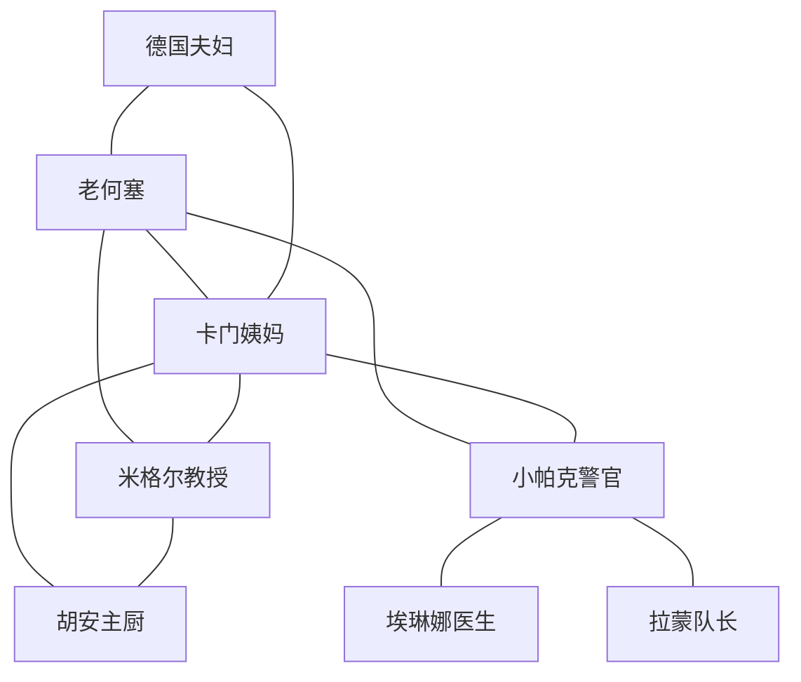

# 👥 共享角色数据库

*泰德峰推理宇宙的循环角色资料库*

## 🔍 快速角色查找

### **按职业分类**
- **执法人员** → [小帕克警官](#小帕克警官)
- **服务行业** → [卡门姨妈](#卡门姨妈)、[老何塞](#老何塞)
- **学术界** → [米格尔教授](#米格尔教授)、[安娜博士](#安娜博士)
- **医疗系统** → [埃琳娜医生](#埃琳娜医生)
- **商业界** → [佩德罗酒庄主](#佩德罗酒庄主)
- **游客群体** → [德国夫妇](#德国夫妇müller)

### **按系列使用频率**
- **🍪 舒适推理核心** → 玛丽亚大婶、卡门姨妈、胡安主厨
- **🏛️ 历史悬疑核心** → 米格尔教授、安娜博士、路易斯馆长  
- **💀 惊悚推理核心** → 卡洛斯博士、拉蒙队长、小帕克警官
- **🍷 美食推理核心** → 伊莎贝拉、佩德罗、胡安主厨

---

## 🌟 核心循环角色

### **老何塞**（José Hernández Guanche, 75岁）
**🎯 宇宙地位**：四个系列最重要的连接点

#### **基本信息**
- **职业**：泰德峰缆车操作员（1984-2024，40年经验）
- **住所**：缆车下站旁的维护小屋（政府提供的员工宿舍）
- **血统**：关契人后裔，Taoro王国末代国王Bencomo的远房后代
- **家庭**：独身，无子女，侄子在Santa Cruz当消防员

#### **外貌特征**
- **身材**：1.68米，瘦削但结实，常年户外工作晒得黝黑
- **面容**：深棕色皮肤，满脸皱纹，眼神睿智深邃
- **服装**：永远穿着泰德峰国家公园的蓝色工作服，胸前别着20年服务徽章
- **标志物**：古铜色的关契人护身符（小陶片），从不离身

#### **性格特质**
- **智慧老人**：虽然只有小学文化，但观察力敏锐，人情世故通达
- **口述历史家**：记得祖父讲的关契人故事，是活的历史书
- **天气预报员**：能从细微变化预测泰德峰天气，准确率超过气象局
- **守护者**：认为自己是泰德峰的守护者，对山里的一草一木都有感情

#### **关键能力**
- **山地救援**：熟悉泰德峰每条小径，多次参与救援行动
- **天气预测**：能从云层、风向、动物行为预测天气变化
- **历史记忆**：祖辈口传的关契人历史，包括一些失传的传说
- **人际网络**：认识岛上大部分的老住户，消息灵通

#### **各系列中的作用**

**🍪 舒适推理中**：
- **角色定位**：智慧长者、社区记忆
- **典型场景**：在缆车站小屋里泡茶聊天
- **提供帮助**：证实不在场证明、讲述家族历史
- **经典台词**："我这把年纪，岛上的每个家族我都了解"

**🏛️ 历史悬疑中**：
- **角色定位**：口述历史的守护者
- **典型场景**：夜晚在篝火旁讲述关契人传说
- **提供帮助**：古老传说的线索、隐秘地点的指引
- **经典台词**："我祖父的祖父说过，关契人的秘密从未完全消失"

**💀 惊悚推理中**：
- **角色定位**：最后关头的英雄救援者
- **典型场景**：在恶劣天气中驾驶维修车营救
- **提供帮助**：山地救援、天气预警、紧急避难
- **经典台词**："泰德峰的脾气我摸了40年，跟着我走！"

**🍷 美食推理中**：
- **角色定位**：传统美食文化的传承者
- **典型场景**：分享祖母制作gofio的传统方法
- **提供帮助**：传统食谱、野生食材知识、节庆习俗
- **经典台词**："真正的加那利味道，只有老一辈人才记得"

#### **背景故事**
老何塞1949年出生在La Orotava一个贫穷家庭。祖父是关契人后裔，在家族中口传着许多古老的故事。年轻时在建筑工地工作，1984年泰德峰缆车建成时成为首批操作员。40年来，他见证了无数游客的喜怒哀乐，也参与了大大小小的救援行动。他从未结婚，把缆车站当成自己的家，把泰德峰当成自己的孩子。

#### **人际关系网络**
- **卡门姨妈**：老朋友，经常去她的咖啡馆
- **米格尔教授**：学术伙伴，为教授提供口述历史
- **小帕克警官**：救援搭档，多次合作救援
- **玛丽亚大婶**：远房表亲，节日时会拜访

---

### **卡门姨妈**（Carmen Silva Hernández, 68岁）
**🎯 宇宙地位**：信息中枢，四个系列的消息集散地

#### **基本信息**
- **职业**：Café Mencey老板娘（1978年接手，46年经营）
- **住所**：咖啡馆楼上的小公寓
- **家庭**：寡妇，丈夫10年前去世，女儿在马德里工作
- **地位**：La Laguna老城区的意见领袖

#### **外貌特征**
- **身材**：1.55米，丰满身材，行动利索
- **面容**：银白短发，总是化淡妆，笑容温和
- **服装**：总穿着干净的围裙，颜色每天不同
- **标志物**：右手无名指的金婚戒，从不摘下

#### **性格特质**
- **记忆超群**：记得每个客人的喜好，十年前的八卦都记得清清楚楚
- **消息灵通**：La Laguna发生的大小事情，她总是第一个知道
- **母性关怀**：对年轻顾客像对自己孩子一样关心
- **商业头脑**：虽然亲切，但经营咖啡馆很有一套

#### **咖啡馆特色**
- **装修风格**：传统加那利风格，墙上挂满La Laguna历史照片
- **招牌饮品**：Barraquito（分层咖啡），配方是祖传秘方
- **常客群体**：大学教授、退休老人、学生、政府职员
- **营业时间**：早7点到晚10点，365天不休息

#### **各系列中的作用**

**🍪 舒适推理中**：
- **角色定位**：社区八卦中心，温暖的倾听者
- **典型场景**：边擦拭咖啡杯边聊天
- **提供帮助**：提供社区内的人际关系信息
- **经典台词**："来杯咖啡慢慢说，这里没有解决不了的问题"

**🏛️ 历史悬疑中**：
- **角色定位**：历史见证者，老照片的守护者
- **典型场景**：指着墙上的老照片讲述往事
- **提供帮助**：提供历史线索、介绍相关人物
- **经典台词**："这张照片是1962年拍的，你看这个人..."

**💀 惊悚推理中**：
- **角色定位**：安全港湾，信息收集点
- **典型场景**：紧急时刻为角色提供避难所
- **提供帮助**：联络网络、收集情报
- **经典台词**："孩子，有危险就来我这里，我给你想办法"

**🍷 美食推理中**：
- **角色定位**：传统美食的推荐者
- **典型场景**：推荐传统小食和家庭餐厅
- **提供帮助**：美食线索、厨师介绍
- **经典台词**："要尝真正的本地味道，我知道一个地方..."

---

### **小帕克警官**（Francisco "Paco" Díaz Morales, 28岁）
**🎯 宇宙地位**：成长型角色，四个系列中的执法代表

#### **基本信息**
- **职业**：La Laguna地方警察局巡警（2020年入职）
- **住所**：Santa Cruz新城区的小公寓
- **家庭**：未婚，与女友Ana交往3年（她在银行工作）
- **教育**：警校毕业，正在进修犯罪学学位

#### **外貌特征**
- **身材**：1.78米，健壮体型，经常健身
- **面容**：方正脸庞，浓眉大眼，总是刮得很干净
- **制服**：蓝色地方警察制服，总是保持整洁
- **装备**：标准警用装备，笔记本不离身

#### **性格特质**
- **认真负责**：对工作极其认真，记录详细
- **学习能力强**：虽然经验不足，但学习能力很强
- **正义感强**：相信法律和正义，有时过于理想主义
- **成长中**：从青涩新人逐渐成长为可靠警员

#### **专业能力**
- **基础警务**：治安维护、交通管制、社区警务
- **调查技能**：询问取证、现场保护、报告撰写
- **体能优秀**：跑步、游泳、攀岩都很在行
- **语言能力**：西语、英语流利，简单德语

#### **各系列中的成长轨迹**

**🍪 舒适推理中**：
- **第1-5本**：处理第一宗命案，紧张而认真
- **第6-15本**：逐渐熟悉社区警务，与居民建立信任
- **第16-25本**：成为社区的可靠守护者
- **经典台词**："我还在学习，但我会尽全力保护大家"

**🏛️ 历史悬疑中**：
- **成长线**：从不相信古老传说到尊重历史文化
- **角色发展**：学会与学者合作，处理文物相关案件
- **经典台词**："也许古老的智慧能帮助我们找到真相"

**💀 惊悚推理中**：
- **成长线**：从害怕危险到勇敢面对挑战
- **角色发展**：紧急情况下的决策能力和领导力
- **经典台词**："我发誓要保护这个岛上的每一个人"

**🍷 美食推理中**：
- **成长线**：学会理解和尊重传统文化
- **角色发展**：处理文化冲突、商业纠纷的技巧
- **经典台词**："传统和现代都需要保护，需要平衡"

#### **人际关系**
- **老何塞**：救援行动中的搭档，学习山地知识
- **卡门姨妈**：经常在她的咖啡馆吃早餐
- **米格尔教授**：学习历史知识，处理文物案件
- **女友Ana**：银行职员，提供金融方面的帮助

---

### **米格尔教授**（Miguel Rodríguez Candelaria, 52岁）
**🎯 宇宙地位**：知识权威，历史悬疑系列的核心角色

#### **基本信息**
- **职业**：La Laguna大学考古系主任教授（1998年起）
- **专业**：前哥伦布时期考古学，关契人文化研究专家
- **学历**：马德里康普顿斯大学博士，哈佛大学访问学者
- **住所**：La Laguna大学教授社区的联排别墅

#### **外貌特征**
- **身材**：1.72米，中等身材，略微发福
- **面容**：棕色头发开始花白，戴黑框眼镜
- **服装**：斜纹软呢夹克，总是背着皮革公文包
- **习惯**：思考时喜欢咬眼镜腿，说话时手势丰富

#### **学术成就**
- **著作**：《关契人王国研究》（1995年）、《加那利群岛考古学》（2003年）
- **发现**：参与了多项重要考古发现，包括关契人墓葬群
- **荣誉**：西班牙考古学会会员，加那利文化遗产保护委员会专家
- **国际声誉**：在欧美考古学界享有声望

#### **性格特质**  
- **学者风范**：严谨治学，对历史真相执着追求
- **好奇心强**：对未解之谜充满兴趣，不轻易放弃
- **正直善良**：坚持学术道德，反对文物盗挖
- **有些书呆子气**：生活能力一般，常常忘记日常事务

#### **在各系列中的作用**

**🏛️ 历史悬疑中**：
- **角色定位**：主角，业余侦探
- **典型场景**：在古籍图书馆研究，或在考古现场指导
- **核心能力**：历史知识、文物鉴定、古文献解读
- **经典台词**："历史从不撒谎，只是我们还没有找到正确的解读方法"

**🍪 舒适推理中**：
- **角色定位**：学识渊博的邻居
- **提供帮助**：历史背景知识、文献查证
- **经典台词**："这个传说背后可能隐藏着真实的历史"

**💀 惊悚推理中**：
- **角色定位**：提供专业知识的专家
- **提供帮助**：地质知识、历史地图、古代路径
- **经典台词**："古人的智慧也许能帮我们找到出路"

**🍷 美食推理中**：
- **角色定位**：传统文化的阐释者
- **提供帮助**：食物历史、传统工艺、文化意义
- **经典台词**："每道传统菜肴都承载着历史的记忆"

#### **家庭背景**
米格尔出生在Santa Cruz的中产家庭，父亲是政府职员，母亲是小学教师。从小对历史感兴趣，大学期间选择考古专业。留学哈佛期间遇到妻子Isabel（美国人），但婚姻在10年前结束。现在独自生活，把所有精力投入到学术研究中。

---

## 👥 次要循环角色

### **胡安主厨**（Juan Carlos Pérez, 45岁）
- **职业**：El Rincón del Gofio餐厅主厨兼老板
- **特色**：三代传承的家族餐厅，传统加那利料理专家
- **外貌**：中等身材，永远穿着白色厨师服，手上有多年厨艺留下的小伤疤
- **性格**：热情开朗，对传统美食极其自豪，但也接受创新

**各系列中的作用**：
- 🍪 **舒适推理**：玛丽亚的老朋友，提供传统食谱和家族秘密
- 🍷 **美食推理**：重要的美食线索提供者，传统与现代的冲突体现者
- 🏛️ **历史悬疑**：了解食物历史，古老食谱的保存者
- 💀 **惊悚推理**：提供避难场所，了解供应链和人员流动

### **德国夫妇Müller**（Hans & Greta Müller, 60多岁）
- **身份**：德国退休夫妇，每年10月来特内里费度假
- **特点**：摄影爱好者，总在"错误时间出现在正确地点"
- **作用**：无意中的目击者，照片中的关键线索

### **埃琳娜医生**（Dra. Elena Vázquez, 38岁）
- **职业**：Candelaria大学医院急诊科医生
- **专业**：急诊医学，毒理学
- **作用**：医学专业知识提供者，法医学协助

### **拉蒙队长**（Ramón Santana, 42岁）
- **职业**：消防救援队长
- **专业**：山地救援，紧急医疗
- **作用**：紧急情况的专业救援者

---

## 🔄 角色关系网络图

## 📝 角色使用指南

### **角色出场频率建议**
- **每本书必须出现**：老何塞、卡门姨妈
- **经常出现**：小帕克警官（每2-3本）
- **定期出现**：米格尔教授（每4-5本，历史悬疑系列除外）
- **偶尔出现**：其他次要角色（根据剧情需要）

### **角色发展原则**
1. **一致性**：角色在不同系列中保持基本性格一致
2. **成长性**：允许角色在时间线中有合理的成长变化
3. **专业性**：各自的专业技能保持可信度
4. **人性化**：避免完美角色，保持人物的缺点和弱点

### **对话风格差异**
- **老何塞**：简单直白，经常引用俗语和传说
- **卡门姨妈**：温暖亲切，喜欢使用昵称
- **小帕克**：正式严谨，但在熟人面前会放松
- **米格尔教授**：学术化表达，偶尔引用历史

---

## 🔗 相关文档链接

→ **地点信息**：[地点数据库](02a-LOCATIONS-DATABASE.md)  
→ **对话示例**：[速查手册](13-QUICK-REFERENCE.md#西班牙语常用词汇)  
→ **写作指南**：[写作准则](07-WRITING-GUIDELINES.md#场景描写技巧)  
→ **系列规划**：[系列详细规划](06-SERIES-PLANNING.md)

---

**使用提示**：这些角色是连接四个系列的重要纽带。写作时，记住每个角色都有自己的生活和故事，他们不仅仅是为了推进情节而存在的工具。

**版本**：1.0 | **最后更新**：2025-01-27 | **角色总数**：11个