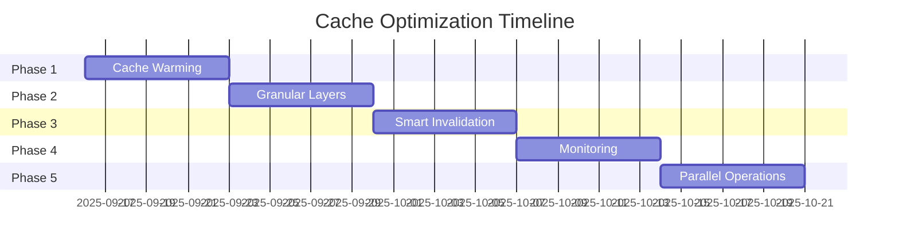

# Cache Optimization Plan - NOVELSYS-SWARM v4.1

## Executive Summary
Extend the successful v4.0 context sharing architecture to achieve 90%+ cache efficiency across all operations.

## Current State (v4.0)
- **Bible Caching**: 30-50% I/O reduction
- **Context Sharing**: 80-95% I/O reduction for analysis
- **Entity Dictionary**: Centralized with file locking
- **Cache Hit Rate**: ~75% estimated

## Optimization Goals
- **Target Cache Hit Rate**: 90%+
- **I/O Reduction**: 95%+ for repetitive operations
- **Response Time**: <100ms for cached operations
- **Memory Footprint**: <500MB total cache size

## Implementation Plan

### Phase 1: Intelligent Cache Warming (Week 1)

#### 1.1 Predictive Loading
```python
# Pseudocode for cache-warmer agent
def warm_cache_for_chapter(chapter_num):
    # Preload likely needed resources
    cache.load_bible()
    cache.load_entity_dictionary()
    cache.load_previous_chapter(chapter_num - 1)
    cache.load_chapter_outline(chapter_num)
    cache.prepare_quality_validators()
```

#### 1.2 Implementation
- Create new agent: `cache-warmer`
- Triggered before chapter generation
- Parallel preloading of resources
- Smart prediction based on workflow

### Phase 2: Granular Cache Layers (Week 2)

#### 2.1 Cache Hierarchy
```yaml
L1_Cache: # Memory (fastest)
  - Active Bible content
  - Current chapter data
  - Hot entity references
  - Size: 50MB
  - TTL: Session

L2_Cache: # Local disk (fast)
  - All Bible versions
  - Recent chapters
  - Entity dictionary
  - Size: 200MB
  - TTL: 24 hours

L3_Cache: # Compressed archives (storage)
  - Historical versions
  - Completed books
  - Analysis reports
  - Size: Unlimited
  - TTL: Project lifetime
```

#### 2.2 Cache Strategy
```python
# Cache access pattern
def get_resource(key):
    if L1_Cache.has(key):
        return L1_Cache.get(key)  # <10ms
    elif L2_Cache.has(key):
        data = L2_Cache.get(key)   # <50ms
        L1_Cache.promote(key, data)
        return data
    else:
        data = load_from_disk(key)  # 100-500ms
        update_caches(key, data)
        return data
```

### Phase 3: Smart Invalidation (Week 3)

#### 3.1 Dependency Tracking
```yaml
cache_dependencies:
  bible_cache:
    depends_on:
      - series_bible.yaml
      - book_N/bible.yaml
    invalidates:
      - chapter_outlines
      - entity_validations
      
  entity_cache:
    depends_on:
      - entity_dictionary.yaml
    invalidates:
      - character_contexts
      - name_variations
```

#### 3.2 Invalidation Rules
```python
# Intelligent invalidation
def should_invalidate(cache_entry):
    # Check file modification time
    if source_modified_after(cache_entry.cached_at):
        return True
    
    # Check content hash
    if content_hash_changed(cache_entry.content_hash):
        return True
    
    # Check dependent caches
    for dep in cache_entry.dependencies:
        if dep.invalidated:
            return True
    
    return False
```

### Phase 4: Cache Monitoring (Week 4)

#### 4.1 Metrics Collection
```yaml
cache_metrics:
  - hit_rate: percentage of cache hits
  - miss_rate: percentage of cache misses
  - eviction_rate: how often cache is full
  - avg_response_time: average cache response
  - memory_usage: current cache size
  - top_missed_keys: frequently missed items
```

#### 4.2 Monitoring Agent
Create `cache-monitor` agent:
```python
# Monitor and optimize cache
def analyze_cache_performance():
    metrics = collect_cache_metrics()
    
    if metrics.hit_rate < 0.75:
        suggest_cache_warming(metrics.top_missed_keys)
    
    if metrics.memory_usage > 0.9 * MAX_SIZE:
        trigger_cache_eviction(LRU_policy)
    
    if metrics.avg_response_time > 100:
        optimize_cache_structure()
    
    return optimization_report
```

### Phase 5: Parallel Cache Operations (Week 5)

#### 5.1 Concurrent Access
```python
# Thread-safe cache operations
class ThreadSafeCache:
    def __init__(self):
        self.cache = {}
        self.locks = {}
    
    def get(self, key):
        with self.read_lock(key):
            return self.cache.get(key)
    
    def set(self, key, value):
        with self.write_lock(key):
            self.cache[key] = value
```

#### 5.2 Batch Operations
```python
# Batch cache operations for efficiency
def batch_cache_operation(keys):
    # Single lock acquisition
    with cache.batch_lock():
        results = {}
        for key in keys:
            results[key] = cache.get(key)
        return results
```

## Expected Outcomes

### Performance Improvements
| Metric | Current | Target | Improvement |
|--------|---------|--------|-------------|
| Cache Hit Rate | 75% | 90% | +15% |
| Avg Response Time | 100-500ms | <100ms | 5x faster |
| I/O Operations | -80% | -95% | Additional 15% |
| Memory Usage | Untracked | <500MB | Controlled |

### Risk Mitigation
1. **Memory Overflow**: Implement strict cache size limits
2. **Stale Data**: Use content hashing for validation
3. **Lock Contention**: Fine-grained locking strategy
4. **Complexity**: Gradual rollout with fallbacks

## Implementation Schedule



## Success Metrics

### Week 1-2: Foundation
- [ ] Cache warmer agent created
- [ ] L1/L2/L3 cache layers implemented
- [ ] Basic metrics collection

### Week 3-4: Intelligence
- [ ] Dependency tracking active
- [ ] Smart invalidation working
- [ ] Monitoring dashboard available

### Week 5: Optimization
- [ ] 90% cache hit rate achieved
- [ ] <100ms average response time
- [ ] 95% I/O reduction confirmed

## Rollback Plan

If issues arise:
1. Disable L1 cache, keep L2/L3
2. Revert to v4.0 context sharing only
3. Fall back to direct file access
4. Each phase can be independently disabled

---
*Plan Version: 1.0*
*Created: 2025-09-09*
*Target Completion: 2025-10-18*