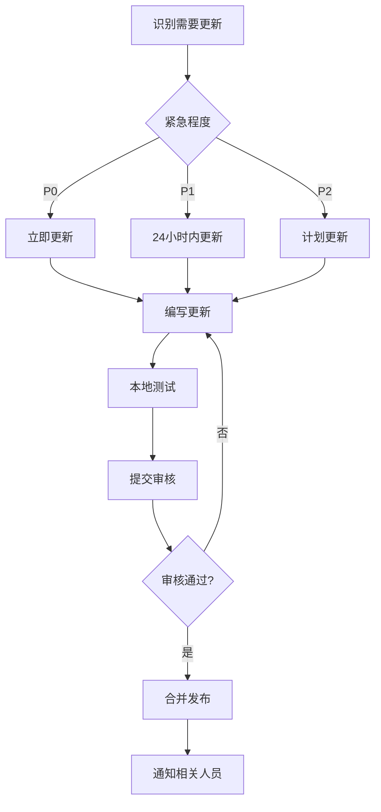

# 文档维护指南

> 确保NOVELSYS-SWARM文档始终保持最新、准确、有用  
> Version: 2.5.0 | Updated: 2025-01-30

## 📋 目录

- [维护原则](#维护原则)
- [文档分类](#文档分类)
- [更新流程](#更新流程)
- [审核标准](#审核标准)
- [归档策略](#归档策略)
- [工具和自动化](#工具和自动化)

## 🎯 维护原则

### 核心原则
1. **准确性** - 文档必须反映当前实际情况
2. **及时性** - 变更后24小时内更新相关文档
3. **完整性** - 覆盖所有功能和API
4. **可读性** - 清晰、简洁、易懂
5. **可追溯** - 记录所有重要变更

## 📂 文档分类

### 按重要性分类

#### P0 - 关键文档（立即更新）
| 文档 | 更新触发条件 | 负责人 |
|-----|-------------|--------|
| README.md | 版本发布、重大功能 | 项目负责人 |
| SYSTEM-ARCHITECTURE-COMPLETE.md | 架构变更 | 架构师 |
| docs/COMMANDS.md | 新增/修改命令 | 功能开发者 |
| docs/TROUBLESHOOTING.md | 发现严重问题 | 支持团队 |

#### P1 - 重要文档（24小时内）
| 文档 | 更新触发条件 | 负责人 |
|-----|-------------|--------|
| docs/API-REFERENCE.md | API变更 | API开发者 |
| docs/AGENTS.md | Agent修改 | Agent开发者 |
| CHANGELOG.md | 版本发布 | 版本管理员 |
| .claude/docs/ARCHITECTURE.md | 技术决策 | 技术委员会 |

#### P2 - 常规文档（一周内）
| 文档 | 更新触发条件 | 负责人 |
|-----|-------------|--------|
| docs/PERFORMANCE.md | 性能优化 | 性能团队 |
| docs/TESTING.md | 测试策略变更 | QA团队 |
| CONTRIBUTING.md | 流程变更 | 项目管理 |
| 模块文档 | 模块实现变更 | 模块负责人 |

## 🔄 更新流程

### 1. 标准更新流程



### 2. 紧急更新流程

用于修复严重文档错误：

```bash
# 1. 创建紧急修复分支
git checkout -b hotfix/doc-emergency

# 2. 快速修复
vim README.md

# 3. 提交
git commit -m "docs: emergency fix for critical error"

# 4. 直接推送（需要权限）
git push origin hotfix/doc-emergency

# 5. 创建紧急PR
gh pr create --title "URGENT: Fix critical doc error" --label emergency
```

## 📝 文档模板

### 功能文档模板

```markdown
# 功能名称

> 简短描述  
> Version: x.x.x | Updated: YYYY-MM-DD

## 概述
功能的详细介绍

## 使用方法
### 基础用法
```bash
示例命令
```

### 高级用法
详细说明

## API参考
### 函数/类名
- **参数**: 
- **返回值**: 
- **异常**: 

## 示例
完整的使用示例

## 常见问题
Q: 问题
A: 答案

## 相关链接
- [相关文档1]
- [相关文档2]
```

### 模块文档模板

```markdown
# 模块名称

## 模块概述
- **用途**: 
- **依赖**: 
- **版本**: 

## 架构设计
```
ASCII图或Mermaid图
```

## 核心组件
### 组件1
说明

### 组件2
说明

## 接口定义
### 公共接口
详细说明

### 内部接口
详细说明

## 配置选项
| 选项 | 类型 | 默认值 | 说明 |
|-----|------|--------|------|

## 性能考虑
- 时间复杂度
- 空间复杂度
- 优化建议

## 测试要点
- 单元测试
- 集成测试
- 性能测试

## 维护说明
特殊维护要求
```

## ✅ 审核标准

### 内容审核清单

- [ ] **准确性**
  - [ ] 代码示例可运行
  - [ ] API签名正确
  - [ ] 版本号准确

- [ ] **完整性**
  - [ ] 覆盖所有功能点
  - [ ] 包含错误处理
  - [ ] 有故障排除章节

- [ ] **格式规范**
  - [ ] Markdown语法正确
  - [ ] 代码块指定语言
  - [ ] 链接有效

- [ ] **可读性**
  - [ ] 结构清晰
  - [ ] 语言简洁
  - [ ] 术语一致

### 技术审核要点

1. **代码示例审核**
   
   **Code example review specialist:**
   1. Verify that example code can be copied and executed directly
   2. Check that all necessary imports are included
   3. Ensure appropriate error handling is implemented
   4. Validate adherence to project coding standards
   5. Return approval status with specific feedback for any issues found

2. **API文档审核**
   - 参数类型正确
   - 返回值说明清楚
   - 异常情况完整
   - 版本兼容性说明

## 🗄️ 归档策略

### 归档时机

| 情况 | 操作 | 归档位置 |
|------|------|---------|
| 主版本升级 | 归档旧版本文档 | .claude/archives/vX.X/ |
| 功能废弃 | 3个月后归档 | .claude/archives/deprecated/ |
| 实验失败 | 立即归档 | .claude/archives/experiments/ |
| 文档过期 | 6个月后归档 | .claude/archives/outdated/ |

### 归档流程

```bash
# 1. 创建归档目录
mkdir -p .claude/archives/v2.0

# 2. 移动文档
mv docs/old-feature.md .claude/archives/deprecated/

# 3. 更新索引
vim docs/index.md  # 移除旧链接

# 4. 添加归档说明
echo "Archived on $(date)" > .claude/archives/deprecated/README.md

# 5. 提交变更
git add .claude/archives/
git commit -m "docs: archive deprecated documentation"
```

### 归档文档格式

```markdown
# [已归档] 原文档标题

> ⚠️ **此文档已归档**  
> 归档日期: YYYY-MM-DD  
> 归档原因: 版本升级/功能废弃/其他  
> 替代文档: [新文档链接]

---

[原始内容保持不变]
```

## 🛠️ 工具和自动化

### 文档生成工具

```bash
# 从代码生成API文档
python scripts/generate_api_docs.py

# 生成命令文档
python scripts/generate_command_docs.py

# 检查文档链接
python scripts/check_links.py

# 生成文档统计
python scripts/doc_stats.py
```

### 自动化检查

```yaml
# .github/workflows/doc-check.yml
name: Documentation Check

on:
  pull_request:
    paths:
      - '**.md'
      - 'docs/**'

jobs:
  check:
    runs-on: ubuntu-latest
    steps:
      - uses: actions/checkout@v2
      
      - name: Check Markdown
        run: |
          npm install -g markdownlint-cli
          markdownlint '**/*.md'
      
      - name: Check Links
        run: |
          npm install -g markdown-link-check
          find . -name "*.md" | xargs -n 1 markdown-link-check
      
      - name: Check Spelling
        run: |
          npm install -g cspell
          cspell "**/*.md"
```

### 文档监控

**Document health monitoring specialist:**

**Check document freshness:**
1. Initialize empty list for stale documents
2. Walk through all directories starting from 'docs' folder
3. For each directory and subdirectory:
   - Filter files to only include .md files
   - Get the full file path by joining root directory and filename
   - Retrieve the file's last modification timestamp
   - Calculate age by subtracting modification time from current time
   - If age exceeds 90 days, add to stale documents list with path and age in days
4. If stale documents found:
   - Print header message "需要更新的文档:"
   - For each stale document, print formatted output with path and days since update
5. Return list of documents requiring updates

## 📊 维护指标

### 关键指标

| 指标 | 目标 | 测量方法 |
|------|------|---------|
| 文档覆盖率 | >95% | 功能文档/总功能数 |
| 更新及时性 | <24h | 平均更新延迟 |
| 链接有效率 | 100% | 有效链接/总链接数 |
| 示例可运行率 | 100% | 可运行示例/总示例数 |

### 质量评分

**Document quality scoring specialist:**

**Calculate document quality score:**
1. Initialize base score at 100 points
2. Apply scoring deductions based on quality checks:
   - Deduct 10 points if document hasn't been updated in over 30 days
   - Deduct 5 points if table of contents structure is missing
   - Deduct 5 points if code examples are missing or insufficient
   - Deduct 2 points for each broken or invalid link found
   - Deduct 1 point for each spelling error detected
3. Return final calculated quality score after all deductions applied

## 📅 维护计划

### 日常维护
- 每日检查PR中的文档更新
- 每日更新FAQ和故障排除

### 周维护
- 检查所有链接有效性
- 更新性能指标
- 审核新增文档

### 月度维护
- 全面文档审查
- 更新架构图
- 清理过期内容
- 生成维护报告

### 季度维护
- 重构文档结构
- 归档旧文档
- 更新所有示例代码
- 用户反馈整合

## 🆘 常见问题

### Q: 文档更新后如何通知团队？
A: 通过以下方式：
1. PR描述中标注 `[DOCS]`
2. 在团队频道发布更新通知
3. 更新CHANGELOG.md

### Q: 如何处理文档冲突？
A: 遵循以下优先级：
1. 代码实现优先
2. 最新版本优先
3. 官方文档优先

### Q: 文档版本如何管理？
A: 
- 使用Git标签管理版本
- 文档头部标注版本号
- 归档旧版本到.claude/archives/

## 📚 相关资源

- [Markdown指南](https://www.markdownguide.org/)
- [技术写作最佳实践](https://developers.google.com/tech-writing)
- [API文档规范](https://swagger.io/specification/)
- [文档工具集](https://www.writethedocs.org/guide/tools/)

---

*最后更新: 2025-01-30 | 维护者: NOVELSYS-SWARM文档团队*