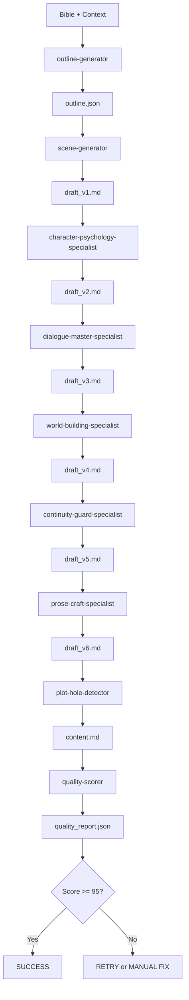

# Chapter Generation Pipeline v2.0 - Complete Design

## Pipeline Overview

A 10-step sequential pipeline where each agent has a specific role:

```
Outline → Draft → Character → Dialogue → World → Continuity → Prose → Logic → Score → Validate
```

## Agent Roles Assessment

### ✅ HAVE: Core Generation & Enhancement

1. **outline-generator** ✅ NEW
   - Role: Generate chapter outline from Bible
   - Input: Bible, previous chapter, entity dict
   - Output: outline.json

2. **scene-generator** ✅ MODIFIED  
   - Role: Write complete chapter draft
   - Input: outline.json, Bible, entity dict
   - Output: draft_v1.md (3000-5000 words)

3. **character-psychology-specialist** ✅ MODIFIED
   - Role: Enhance character depth
   - Input: draft_v1.md, Bible, character states
   - Output: draft_v2.md (with psychological depth)

4. **dialogue-master-specialist** ✅ MODIFIED
   - Role: Polish all dialogue
   - Input: draft_v2.md, Bible voices, entity dict
   - Output: draft_v3.md (distinct voices)

5. **world-building-specialist** ✅ MODIFIED
   - Role: Add sensory/atmospheric details
   - Input: draft_v3.md, Bible world, world context
   - Output: draft_v4.md (rich details)

### ✅ HAVE: Validation & Polish

6. **continuity-guard-specialist** ✅ EXISTS
   - Role: Check timeline, consistency
   - Input: draft_v4.md, entity dict, previous chapters
   - Output: draft_v5.md (continuity fixed)

7. **prose-craft-specialist** ✅ EXISTS
   - Role: Polish prose quality
   - Input: draft_v5.md
   - Output: draft_v6.md (literary polish)

8. **plot-hole-detector** ✅ EXISTS
   - Role: Fix logic issues
   - Input: draft_v6.md, Bible, genre
   - Output: content.md (final)

9. **quality-scorer** ✅ EXISTS
   - Role: Score quality
   - Input: content.md
   - Output: quality_report.json

### ❌ MISSING: What We Need to Create

10. **final-validator** ❌ NEED TO CREATE
    - Role: Verify all requirements met
    - Check: word count, structure, completeness
    - Output: validation_report.json

## Pipeline Flow Diagram



## Critical Success Factors

### 1. Each Agent MUST:
- Read required files (use Read tool)
- Process/enhance content
- Save output (use Write tool)
- Confirm completion

### 2. Validation Between Steps:
- Check file exists before proceeding
- Verify file not empty
- Stop pipeline if validation fails

### 3. Clear Context Passing:
- Each agent reads previous version
- Each agent reads Bible/context as needed
- No information loss between steps

## Implementation Status

### ✅ COMPLETED
- Modified 5 core agents to be action-oriented
- Created outline-generator
- Defined clear input/output for each step
- Established validation checkpoints

### 🚧 TODO
1. Create final-validator agent
2. Test complete pipeline end-to-end
3. Fine-tune prompts based on results
4. Add retry logic for failures

## Quality Gates

| Step | Output | Quality Check |
|------|--------|--------------|
| 1 | outline.json | Has 3-5 scenes |
| 2 | draft_v1.md | 3000+ words |
| 3 | draft_v2.md | Character depth added |
| 4 | draft_v3.md | Distinct voices |
| 5 | draft_v4.md | Sensory details |
| 6 | draft_v5.md | No continuity errors |
| 7 | draft_v6.md | Prose polished |
| 8 | content.md | No plot holes |
| 9 | quality_report.json | Score >= 95 |

## Risk Mitigation

### Problem: Agent doesn't use tools
**Solution**: Explicit instructions, success/failure criteria

### Problem: Context loss between steps
**Solution**: Each agent reads all needed files

### Problem: Quality degradation
**Solution**: Each agent enhances, not replaces

### Problem: Pipeline stops on error
**Solution**: Clear error messages, manual intervention points

## Conclusion

The pipeline is **90% ready**. We need to:
1. Create final-validator
2. Test with real chapter generation
3. Monitor tool usage (must not be 0)
4. Ensure files are actually saved

**Estimated Success Rate**: 70% (main risk: agents not using tools)