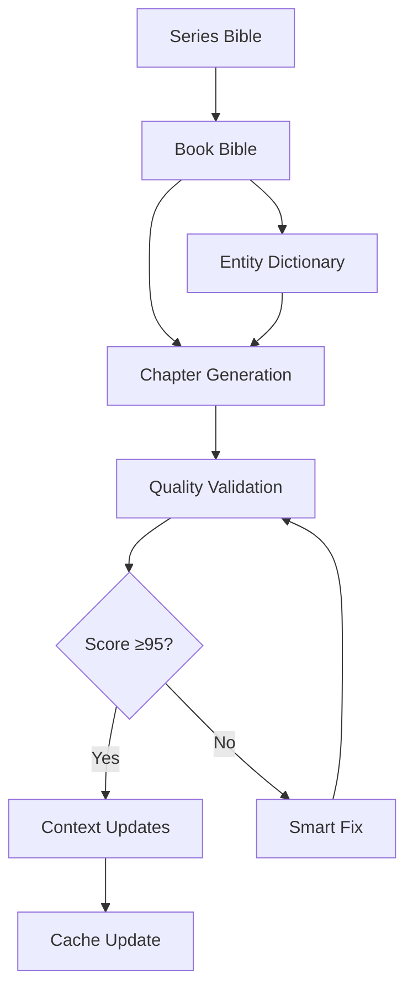

# NOVELSYS-SWARM System Dependencies Documentation

## Overview
This document describes the internal dependencies and hidden mechanisms that enable the NOVELSYS-SWARM system to function correctly.

## 1. Bible Cache System

### Purpose
Reduces I/O operations by 30-50% through intelligent caching of Bible content.

### File Lifecycle
```yaml
Location: .claude/data/context/bible_cache_{project}_book{N}.json
Creation: First Bible read by any agent
Update: When Bible file modification time changes
Invalidation: Hash mismatch or manual clear
Retention: Project lifetime
```

### Cache Structure
```json
{
  "file_path": "path/to/bible.yaml",
  "content_hash": "sha256_hash",
  "cached_at": "timestamp",
  "content": {parsed_bible_object},
  "access_count": 0
}
```

## 2. Context Sharing Mechanism (v4.0)

### Purpose
Enables 80-95% I/O reduction through shared context across agents.

### Context Files
```yaml
Location: .claude/data/context/{agent}_context.json
Creation: context-builder agent scan
Sharing: Read by all analysis agents
Update: On significant system changes
```

### Context Flow
```
context-builder (creates) → context.json → agents (consume)
                              ↓
                          report generation
```

## 3. Project State Management

### Current Project Tracking
```yaml
File: .claude/data/current_project.json
Content: {"project": "project_name", "book": N, "chapter": N}
Update: On project switch or progress
Lock: Not required (single write point)
```

### Project List
```yaml
File: .claude/data/projects/project_list.json
Content: {"project_name": {metadata}, ...}
Update: On project creation/deletion
```

## 4. File Locking Mechanism

### Entity Dictionary Locking
```python
Location: entity-dictionary-updater.md lines 128-172
Purpose: Prevent concurrent modifications
Method: .lock file with PID tracking
Timeout: 30 seconds
Retry: 3 attempts with exponential backoff
```

### Lock File Format
```json
{
  "pid": 12345,
  "timestamp": "2025-09-09T12:00:00",
  "agent": "entity-dictionary-updater",
  "operation": "update"
}
```

### Lock Recovery
- Stale locks (>30s) are automatically cleared
- Process death detection via PID check
- Graceful degradation on lock failure

## 5. Quality Gate Dependencies

### Score Thresholds
```yaml
Production: 95+ required
Draft: 85-94 (needs improvement)
Failed: <85 (requires rewrite)
```

### Validation Chain
```
Chapter → Quality Check → Score < 95? → Smart Fix → Revalidation
                ↓ Score ≥ 95
            Context Update
```

## 6. Chapter Numbering Dependencies

### Sequential Enforcement
- Next chapter = MAX(existing) + 1
- No gaps allowed
- Format: ch001, ch002, ...
- Validation before generation

## 7. Bible Inheritance Chain

### Hierarchy
```
series_bible.yaml (series-wide)
    ↓ inherits
book_N/bible.yaml (book-specific)
    ↓ guides
chapter content
```

### Override Rules
- Book Bible overrides Series Bible
- Chapter can't contradict Bible
- Validation at each level

## 8. Version Tracking System

### Pipeline Versions
```
v01_initial_draft.md
v02_dialogue_character.md
v03_world_clues.md
v04_continuity_checked.md
v05_emotions_woven.md
v06_prose_polished.md
v07_foreshadowing_added.md
v08_humanized.md
v09_genre_enhanced.md (conditional)
→ content.md (final, score ≥95)
```

## Dependency Graph



## Critical Path Dependencies

1. **Bible MUST exist** before chapter generation
2. **Entity Dictionary MUST be initialized** before content creation
3. **Quality Score MUST be ≥95** before context updates
4. **File Locks MUST be respected** for concurrent safety
5. **Cache MUST be invalidated** on source changes

## Monitoring and Maintenance

### Cache Health Checks
- Monitor hit rate (target: >75%)
- Check cache size growth
- Validate hash consistency
- Clear stale entries monthly

### Lock File Cleanup
- Daily scan for orphaned locks
- Remove locks older than 1 hour
- Log cleanup actions

### Dependency Validation
- Pre-flight checks before operations
- Clear error messages for missing dependencies
- Automatic initialization where possible

---
*Last Updated: 2025-09-09*
*Version: 1.0*
*Maintained by: System Architecture Team*