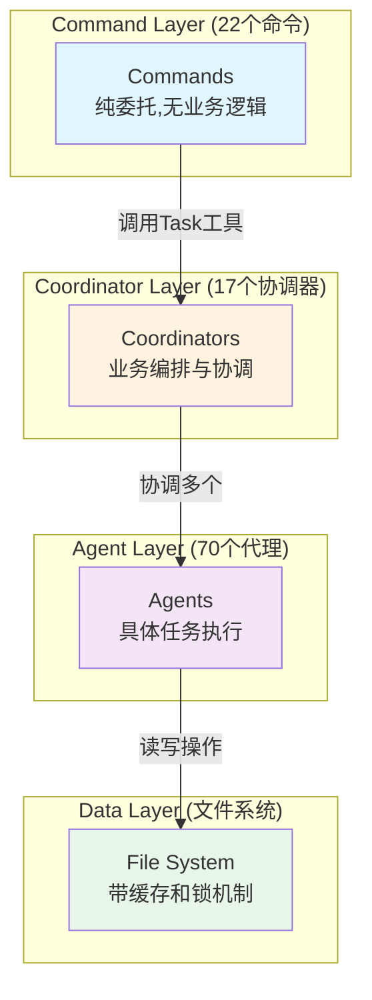
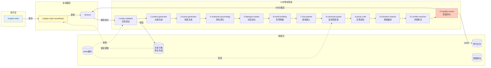
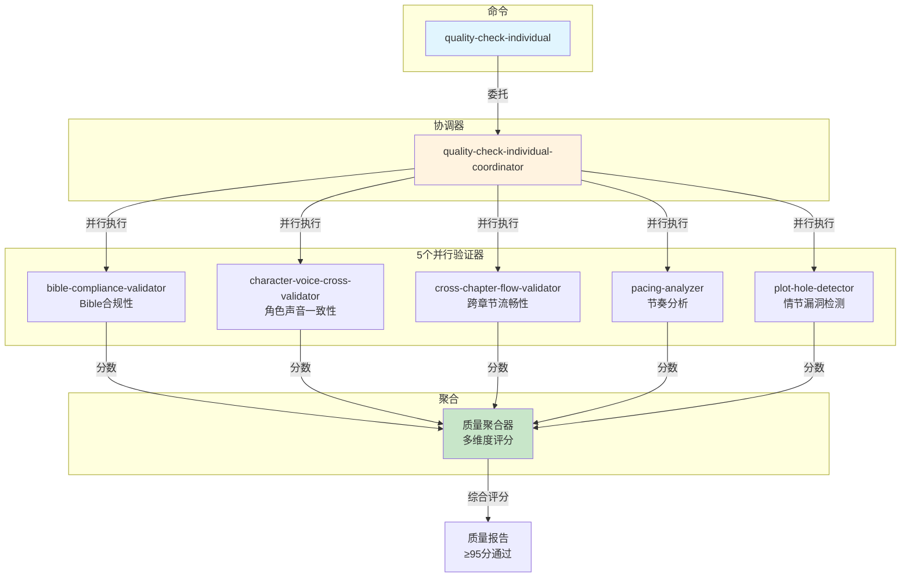
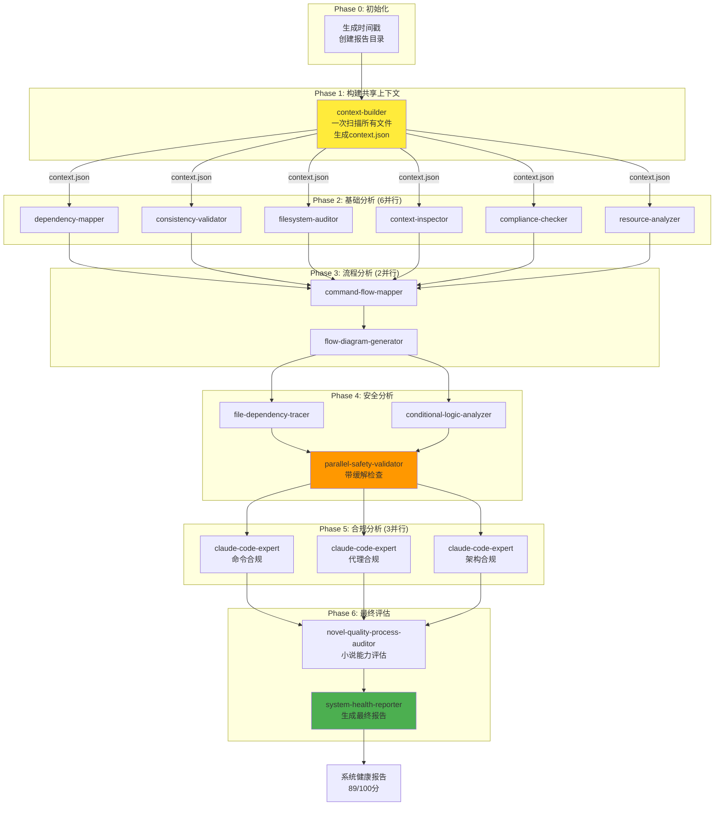
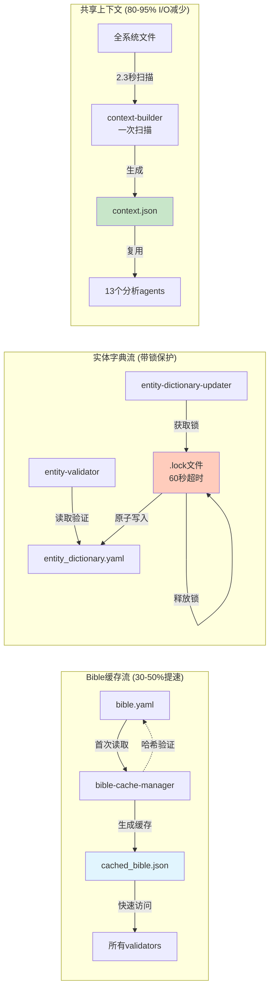
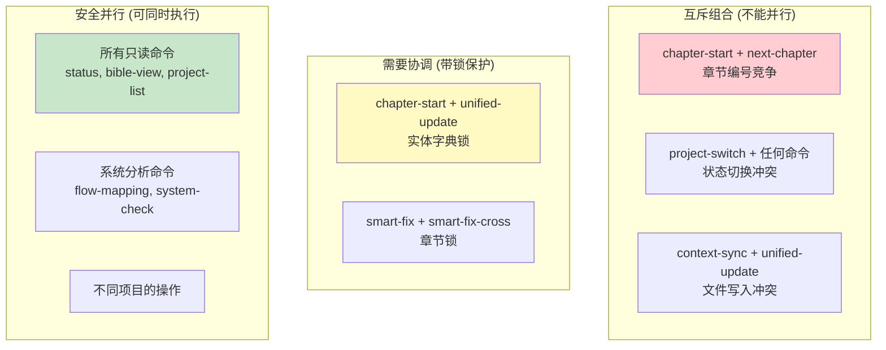

# NOVELSYS-SWARM 完整系统流程图

## 系统架构总览



## 核心流程详解

### 1. 章节生成流程 (复杂度: 8.7/10)



### 2. 质量检查流程 (完全并行化)



### 3. 系统健康检查流程 (5阶段15代理)



### 4. 数据流与优化



### 5. 并发控制矩阵



## 关键性能指标

| 指标 | 值 | 说明 |
|------|-----|------|
| **架构合规度** | 96/100 | Claude Code完美实现 |
| **并行安全分** | 72/100 | 从31分大幅提升 |
| **I/O减少** | 80-95% | 通过共享上下文 |
| **Bible缓存提速** | 30-50% | 验证速度提升 |
| **质量检查加速** | 4x | 并行执行 |
| **章节生成时间** | 3-5分钟 | 12步管道 |
| **系统检查时间** | 5-10分钟 | 15个代理 |
| **生产就绪度** | 89/100 | A-级别 |

## 执行时间估算

- **简单命令** (<1秒): bible-view, status, project-list
- **中等命令** (10-30秒): bible-create, entity-update
- **复杂命令** (1-2分钟): quality-check, unified-update
- **重型命令** (3-5分钟): chapter-start, next-chapter
- **系统命令** (5-10分钟): system-check

## 数据存储结构

```
.claude/
├── data/
│   ├── projects/{project}/
│   │   ├── book_{N}/
│   │   │   ├── bible.yaml
│   │   │   ├── chapters/
│   │   │   │   └── ch{NNN}/
│   │   │   │       ├── content.md
│   │   │   │       └── quality_report.json
│   │   │   └── bible_cache.json
│   │   └── shared/
│   │       ├── entity_dictionary.yaml
│   │       └── .entity_dictionary.lock
│   └── context/
│       ├── {agent}_context.json
│       └── bible_cache_{project}_book{N}.json
└── report/
    └── YYYYMMDD_HHMMSS/
        ├── context.json
        ├── *_report.json (15个)
        └── system_health_report.md
```

---

*基于2025-09-09 v4.0系统健康报告生成*